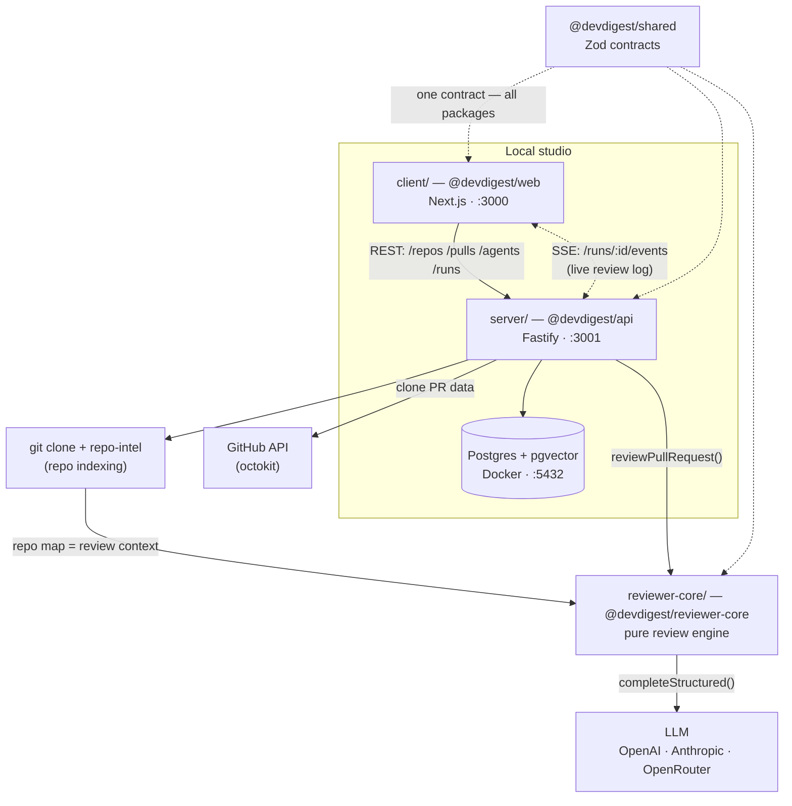

# DevDigest — onboarding

## 🎯 Project goal

**A local AI pull-request reviewer.** You take a PR from GitHub → the tool clones
the repository, indexes it, assembles a prompt from the diff + repo map → sends it
to an LLM → gets structured findings (severity + score) and **filters out
hallucinations** (grounding gate).

Important: **this is an educational starter template.** It does exactly one thing
end-to-end (import a PR + review). Each subsequent course lesson (L01–L08) adds one
feature: cost badge, Smart Diff, MCP server, multi-agent review, and so on. That's
why the code contains "hooks" for future features (empty contracts files, toggles)
— this isn't dead code, but deliberate extension points.

Everything is local. The only external calls are GitHub (PR data) and the LLM
(via OpenRouter).

---

## 🧱 Technology stack

| Layer | Technologies |
|-----|-----------|
| **Web (`client/`)** | Next.js 15 (App Router, React 19), TanStack Query v5, Tailwind v4 (CSS-in-JS + tokens), next-intl, recharts, mermaid, lucide |
| **API (`server/`)** | Fastify 5, Drizzle ORM + Postgres (pgvector), Zod (`fastify-type-provider-zod`), SSE (`fastify-sse-v2`), p-queue (job queue) |
| **Parsing/indexing** | `@ast-grep/napi` (symbols), `dependency-cruiser` (import graph), `graphology` (PageRank), `js-tiktoken` (token budget), `simple-git`, `octokit` |
| **Review engine (`reviewer-core/`)** | Pure logic: `openai` SDK + `zod`. No DB/network/FS |
| **E2E (`e2e/`)** | `agent-browser` (Vercel, CDP — not Playwright), deterministic JSON flows, no LLM |
| **Infra** | Docker (Postgres 16 + pgvector only), pnpm (except reviewer-core → npm) |

---

## 📦 How the modules are connected

This is **NOT a monorepo workspace.** Four independent packages, each with its own
`package.json` and lockfile. Code is shared via **tsconfig path aliases**, not npm
packages:

```
@devdigest/shared          → server/src/vendor/shared/index.ts   (Zod contracts, single source of truth)
@devdigest/reviewer-core   → ../reviewer-core/src/index.ts        (runtime import of raw TS!)
@devdigest/ui              → client/src/vendor/ui/index.ts        (design system)
```



### Who talks to whom and HOW

| From | To | How |
|-----|-----|--------|
| `client` | `server` | REST via a typed fetch client (`client/src/lib/api.ts`), cached by TanStack Query |
| `client` | `server` | **SSE** (`EventSource`, one connection per run) — live review log in real time |
| `server` | `Postgres` | Drizzle ORM, every query scoped by `workspace_id` |
| `server` | `GitHub` | `OctokitGitHubClient` (adapter) with retry+timeout |
| `server` | `reviewer-core` | **direct runtime import** of `reviewPullRequest()` — not a built package, but raw TS via alias |
| `server` | `LLM` | via the DI container `Container.llm(id)`, lazily from secrets |
| `repo-intel` | `reviewer-core` | passes the **repo map** (project skeleton ~3K tokens) into the prompt |

**The key end-to-end review path:**
`server/src/modules/reviews/run-executor.ts` (orchestration) → loads the diff → gets
the repo map from `repo-intel` → resolves the LLM → calls `reviewPullRequest()` from
`reviewer-core` → which assembles the prompt, calls the LLM, the **grounding gate**
filters out hallucinations → persists to `findings` → streams events over SSE.

---

## ⭐ Highlights (important architectural decisions)

1. **Grounding gate** (`reviewer-core/src/grounding.ts`) — the headline feature.
   Mechanically verifies that every finding references real lines in the diff. If the
   LLM "invented" line 999 that isn't in the diff — the finding is dropped. The score
   is **recomputed** from the surviving findings, not taken from the model's self-report.

2. **Prompt-injection defense** (`reviewer-core/src/prompt.ts`) — all untrusted
   content (diff, PR description, repo map) is wrapped in `<untrusted source="...">`,
   and `INJECTION_GUARD` is always appended to the system prompt. Closing delimiters
   are escaped.

3. **DI container** (`server/src/platform/container.ts`) — all adapters (git, github,
   llm, tokenizer) are built lazily from secrets. A missing key is caught not at
   startup, but when a route actually touches it. Convenient for tests (overriding mocks).

4. **Job queue** (`p-queue`) — all long-running operations (clone, indexing, polling)
   are async jobs with retry/timeout. Routes return `202 + jobId` immediately; the
   client polls for status.

5. **Degradation instead of errors** — `repo-intel` always returns a valid (even if
   `degraded`) result, never crashing on an indexing error.

6. **Multi-tenancy at the DB level** — every table has a `workspace_id`; deleting a
   workspace cascades everything. No checks needed in each method.

---

## 🤨 Strange / non-obvious parts (footguns)

1. **`reviewer-core` must always be installed** — even if you only touch the API. The
   server imports `../reviewer-core/src` at runtime. If you don't install `openai`/`zod`
   there → the server crashes with `ERR_MODULE_NOT_FOUND`. And it's the **only package
   on `npm`** — the rest are on `pnpm`.

2. **`@devdigest/shared` is vendored, not published.** It lives in
   `server/src/vendor/shared` and is **copied** into `client/src/vendor/shared`. Change
   a Zod schema in one — you must manually sync it into the other, or the types will diverge.

3. **The server does NOT migrate the DB on startup.** The first symptom is
   `relation ... does not exist`. You have to run `cd server && pnpm db:migrate` by hand.

4. **`server/package.json` is skip-worktree.** CI doesn't trust the committed scripts
   and inlines the vitest commands directly. Locally the file may drift.

5. **Test split by filename:** `*.it.test.ts` = integration (needs Docker/testcontainers),
   the rest are hermetic units. The unit lane uses `--exclude '**/*.it.test.ts'`.

6. **PRs in the URL by number, not by UUID** — `/pulls/[number]` shows the GitHub
   number, but internally it resolves to the DB UUID via the `usePulls()` cache.

7. **`notify` as a module-level bridge** (`client/src/lib/toast.tsx`) — so the global
   TanStack Query error handler can show toasts outside the React context.

8. **`docker compose down -v` = data loss.** It drops the volume with all imported
   repositories. To reset e2e, use the hermetic `./scripts/e2e.sh` (an ephemeral DB on
   ports 5433/3101/3100).

---

## ✅ Non-strange (standard, expected) parts

- `server` layering: **routes → services → repositories → Drizzle** — a classic clean
  separation.
- TanStack Query as the single source of server state, with query keys like `["pulls", repoId]`.
- Zod at the API boundary for validation + type inference.
- Adapters for external services (GitHub/git/LLM) behind interfaces — easy to mock.
- Ordinary App Router with colocation (`_components/`).
- Reviewer-core as a pure function with an injected LLM provider — the standard approach
  for testability.

---

## 🚀 How to run

```sh
./scripts/dev.sh          # Postgres + migrations + seed + API:3001 + web:3000
```

Then open http://localhost:3000. Keys go in `server/.env`
(`OPENAI_API_KEY` / `ANTHROPIC_API_KEY`, `GITHUB_TOKEN`) or via the Settings UI.

Flags: `--no-seed` · `--no-client` · `--db-only` · `--help`.

> Testing details are in [`TESTING.md`](TESTING.md). Each package's README has deeper
> diagrams: [`client`](client/README.md) · [`server`](server/README.md) ·
> [`reviewer-core`](reviewer-core/README.md) · [`e2e`](e2e/README.md).
