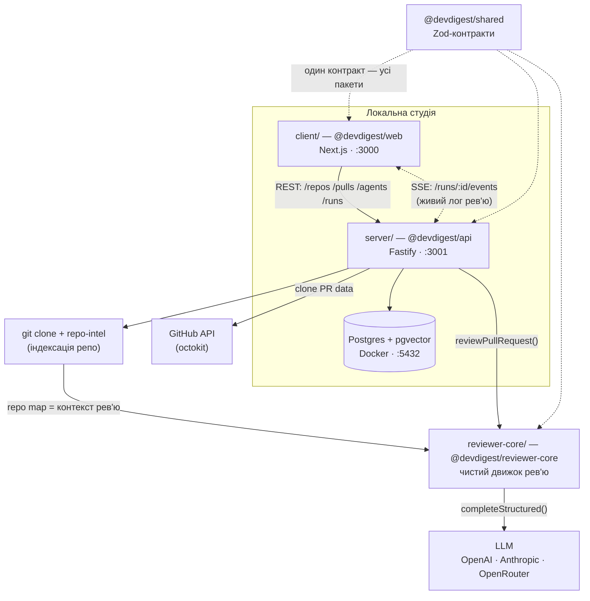

# DevDigest — онбординг

## 🎯 Ціль проєкту

**Локальний AI-рев'ювер пул-реквестів.** Береш PR з GitHub → інструмент клонує
репозиторій, індексує його, збирає промпт із діфа + карти репозиторію → відправляє
в LLM → отримує структуровані знахідки (severity + score) і **відсіює галюцинації**
(grounding gate).

Важливо: **це навчальний starter-шаблон.** Він робить рівно одну річ end-to-end
(імпорт PR + рев'ю). Кожен наступний урок курсу (L01–L08) додає по фічі: cost badge,
Smart Diff, MCP-сервер, multi-agent рев'ю тощо. Тому в коді трапляються «зачіпки» під
майбутні фічі (порожні contracts-файли, тогли) — це не мертвий код, а навмисні
розширення.

Усе локальне. Єдині зовнішні виклики — GitHub (дані PR) і LLM (через OpenRouter).

---

## 🧱 Технологічний стек

| Шар | Технології |
|-----|-----------|
| **Web (`client/`)** | Next.js 15 (App Router, React 19), TanStack Query v5, Tailwind v4 (CSS-in-JS + токени), next-intl, recharts, mermaid, lucide |
| **API (`server/`)** | Fastify 5, Drizzle ORM + Postgres (pgvector), Zod (`fastify-type-provider-zod`), SSE (`fastify-sse-v2`), p-queue (черга джоб) |
| **Парсинг/індексація** | `@ast-grep/napi` (символи), `dependency-cruiser` (граф імпортів), `graphology` (PageRank), `js-tiktoken` (бюджет токенів), `simple-git`, `octokit` |
| **Движок рев'ю (`reviewer-core/`)** | Чиста логіка: `openai` SDK + `zod`. Жодної БД/мережі/ФС |
| **E2E (`e2e/`)** | `agent-browser` (Vercel, CDP — не Playwright), детерміновані JSON-флоу, без LLM |
| **Інфра** | Docker (тільки Postgres 16 + pgvector), pnpm (крім reviewer-core → npm) |

---

## 📦 Як пов'язані модулі

Це **НЕ монорепозиторій-воркспейс.** Чотири незалежні пакети, кожен зі своїм
`package.json` і lockfile. Код шериться через **tsconfig path-аліаси**, а не npm-пакети:

```
@devdigest/shared          → server/src/vendor/shared/index.ts   (Zod-контракти, single source of truth)
@devdigest/reviewer-core   → ../reviewer-core/src/index.ts        (рантайм-імпорт сирого TS!)
@devdigest/ui              → client/src/vendor/ui/index.ts        (дизайн-система)
```



### Хто з ким і ЯК спілкується

| Від | До | Спосіб |
|-----|-----|--------|
| `client` | `server` | REST через типізований fetch-клієнт (`client/src/lib/api.ts`), кешований TanStack Query |
| `client` | `server` | **SSE** (`EventSource`, один конект на run) — живий лог рев'ю в реальному часі |
| `server` | `Postgres` | Drizzle ORM, усі запити скоупляться по `workspace_id` |
| `server` | `GitHub` | `OctokitGitHubClient` (адаптер) з retry+timeout |
| `server` | `reviewer-core` | **прямий рантайм-імпорт** `reviewPullRequest()` — не зібраний пакет, а сирий TS через аліас |
| `server` | `LLM` | через DI-контейнер `Container.llm(id)`, ліниво з секретів |
| `repo-intel` | `reviewer-core` | передає **repo map** (скелет проєкту ~3K токенів) у промпт |

**Ключовий маршрут рев'ю end-to-end:**
`server/src/modules/reviews/run-executor.ts` (оркестрація) → завантажує діф → бере
repo map з `repo-intel` → резолвить LLM → викликає `reviewPullRequest()` з
`reviewer-core` → той збирає промпт, кличе LLM, **grounding gate** відсіює галюцинації
→ persist у `findings` → стрімить події по SSE.

---

## ⭐ Особливості (важливі архітектурні рішення)

1. **Grounding gate** (`reviewer-core/src/grounding.ts`) — головна фіча. Механічно
   перевіряє, що кожна знахідка посилається на реальні рядки діфа. Якщо LLM «вигадала»
   рядок 999, якого немає в діфі — знахідку викидають. Score **перераховується** з
   вцілілих знахідок, а не береться з самозвіту моделі.

2. **Захист від prompt-injection** (`reviewer-core/src/prompt.ts`) — увесь недовірений
   контент (дiф, опис PR, repo map) обгортається в `<untrusted source="...">`, а в
   системний промпт завжди додається `INJECTION_GUARD`. Закривні делімітери екрануються.

3. **DI-контейнер** (`server/src/platform/container.ts`) — усі адаптери (git, github,
   llm, tokenizer) будуються ліниво з секретів. Відсутній ключ ловиться не на старті, а
   коли роут реально його торкнеться. Зручно для тестів (override mock'ів).

4. **Черга джоб** (`p-queue`) — усі довгі операції (clone, індексація, polling) —
   асинхронні джоби з retry/timeout. Роути одразу повертають `202 + jobId`, клієнт
   поллить статус.

5. **Деградація замість помилок** — `repo-intel` завжди повертає валідний (хай і
   `degraded`) результат, ніколи не падає на помилці індексації.

6. **Multi-tenancy на рівні БД** — у кожної таблиці є `workspace_id`, видалення
   воркспейсу каскадить усе. Без перевірок у кожному методі.

---

## 🤨 Дивні / неочевидні частини (footguns)

1. **`reviewer-core` треба інсталити завжди** — навіть якщо чіпаєш тільки API. Сервер
   імпортує `../reviewer-core/src` у рантаймі. Якщо не встановити `openai`/`zod` там →
   сервер падає з `ERR_MODULE_NOT_FOUND`. І це **єдиний пакет на `npm`**, решта на `pnpm`.

2. **`@devdigest/shared` — вендорений, не опублікований.** Живе у
   `server/src/vendor/shared` і **скопійований** у `client/src/vendor/shared`. Зміниш
   Zod-схему в одному — мусиш вручну синхронити в інший, інакше типи розійдуться.

3. **Сервер НЕ мігрує БД на старті.** Перший симптом — `relation ... does not exist`.
   Треба руками `cd server && pnpm db:migrate`.

4. **`server/package.json` — skip-worktree.** CI не довіряє закоміченим скриптам і
   інлайнить vitest-команди напряму. Локально файл може розходитись.

5. **Розбивка тестів за іменем файлу:** `*.it.test.ts` = інтеграційні (потрібен
   Docker/testcontainers), решта — герметичні юніти. Unit-лейн робить
   `--exclude '**/*.it.test.ts'`.

6. **PR в URL за номером, не за UUID** — `/pulls/[number]` показує GitHub-номер, але
   всередині резолвиться в UUID БД через кеш `usePulls()`.

7. **`notify` як module-level bridge** (`client/src/lib/toast.tsx`) — щоб глобальний
   error-handler TanStack Query міг показувати тости поза React-контекстом.

8. **`docker compose down -v` = втрата даних.** Дропає volume з усіма імпортованими
   репозиторіями. Для скидання e2e використовуй герметичний `./scripts/e2e.sh`
   (ефемерна БД на портах 5433/3101/3100).

---

## ✅ Не дивні (стандартні, очікувані) частини

- Шарування `server`: **routes → services → repositories → Drizzle** — класичне чисте
  розшарування.
- TanStack Query як єдине джерело серверного стану, query-keys типу `["pulls", repoId]`.
- Zod на межі API для валідації + інференс типів.
- Адаптери для зовнішніх сервісів (GitHub/git/LLM) за інтерфейсами — легко мокати.
- Звичайний App Router з colocation (`_components/`).
- Reviewer-core як чиста функція з ін'єктованим LLM-провайдером — стандартний підхід
  для тестабельності.

---

## 🚀 Як запустити

```sh
./scripts/dev.sh          # Postgres + міграції + сід + API:3001 + web:3000
```

Потім відкрий http://localhost:3000. Ключі — у `server/.env`
(`OPENAI_API_KEY` / `ANTHROPIC_API_KEY`, `GITHUB_TOKEN`) або через Settings UI.

Прапори: `--no-seed` · `--no-client` · `--db-only` · `--help`.

> Деталі тестування — у [`TESTING.md`](TESTING.md). README кожного пакета має глибші
> діаграми: [`client`](client/README.md) · [`server`](server/README.md) ·
> [`reviewer-core`](reviewer-core/README.md) · [`e2e`](e2e/README.md).
