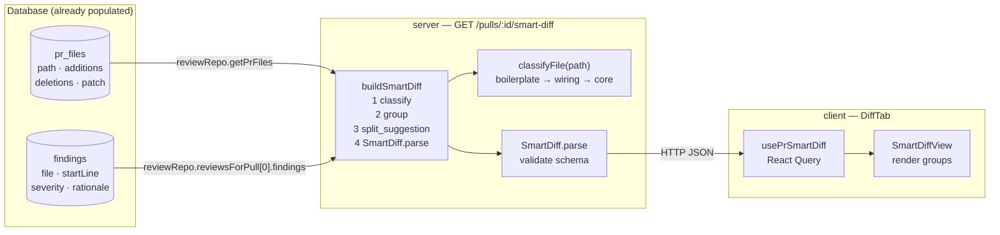

# Smart Diff — How It Works

Smart Diff reorders the "Files changed" tab so reviewers see the most important
files first. This page explains the design decisions behind it and how each piece
contributes to the final output.

## The core idea: deterministic composition, no new LLM call

When a reviewer opens the "Files changed" tab, two pieces of information are
already in the database from earlier work:

- **PR files** — imported at pull-request fetch time; each file has a path,
  additions, deletions, and a diff patch.
- **Review findings** — produced by the Structured Reviewer when the reviewer
  clicks "Run Review"; each finding has a file path, start line, severity, and
  rationale.

Smart Diff's only job is to read those two sources, classify each file, and
compose a single `SmartDiff` response. It does not call any language model. It
does not write to the database. It does not cache. The route is compute-on-read:
fast enough that no caching layer is needed.

## Compose flow

The service (`buildSmartDiff`) runs four steps in a single request:

1. **Classify** — each file path is passed to `classifyFile`, which applies
   pattern checks in precedence order (boilerplate → wiring → core) using plain
   string operations, not regex, to avoid ReDoS risk.
2. **Group** — files are accumulated into three buckets; the response always
   contains all three groups in fixed order (`core`, `wiring`, `boilerplate`),
   even when a group is empty.
3. **Compute split_suggestion** — total lines (additions + deletions) are summed
   over core files only. When the total exceeds `SPLIT_TOO_BIG_LINES` (400),
   `too_big` is set to `true` and core files are grouped by their top-level
   directory to form `proposed_splits`.
4. **Parse** — the composed object is passed through `SmartDiff.parse()`. This is
   the schema gate: if the service produces an invalid shape (for example, an
   unexpected role value), the request fails loudly rather than silently sending
   bad data to the client.

## Classification rules

`classifyFile` applies three tiers in strict precedence order. The first tier to
match wins.

### Boilerplate (checked first)

A file is boilerplate if any of the following is true:

| Check | Examples |
|-------|---------|
| Exact filename match | `package.json`, `pnpm-lock.yaml` |
| Full path ends with suffix | `*-lock.json`, `*.lock` |
| Any path segment equals a boilerplate directory | `dist/`, `build/`, `__snapshots__/` |
| Basename ends with file suffix | `.snap`, `.min.js`, `.map` |

### Wiring (checked second)

A file is wiring if none of the boilerplate checks matched, and any of the
following is true:

| Check | Examples |
|-------|---------|
| Exact basename match | `Dockerfile`, `server.ts`, `config.ts`, `index.ts`, `index.js` |
| Full path ends with env suffix | `.env`, `.env.local`, `.env.production`, `.env.development`, `.env.test` |
| Basename starts with prefix | `tsconfig`, `.eslintrc` |
| Basename contains `.config.` | `vite.config.ts`, `jest.config.js`, `prettier.config.mjs` |
| Under `.github/workflows/` with `.yml` or `.yaml` extension | CI pipeline files |

### Core (default)

Everything that does not match boilerplate or wiring is classified as core.

## `pseudocode_summary` derivation

Each `SmartDiffFile` carries a `pseudocode_summary` field. This is not generated
by a language model. The service reads the `rationale` text from every finding
that the latest review attached to that file, extracts the first sentence of each
rationale (split on `.`, `!`, `?`, or `\n`), joins them with `"; "`, and
truncates the result at 200 characters. The field is `null` when the file has no
findings or when no review has been run yet.

Because `rationale` comes from an earlier LLM call (the Structured Reviewer) but
is stored in the database as plain text, `pseudocode_summary` is derived without
any new model invocation. The server treats rationale text as untrusted data and
never interpolates it into HTML; the client renders it through JSX auto-escaping.

## Split suggestion threshold

`SPLIT_TOO_BIG_LINES = 400` is the single-sourced threshold constant in
`server/src/modules/smart-diff/constants.ts`. It applies to core files only —
boilerplate and wiring churn does not trigger the banner. The client renders a
split-suggestion banner whenever `split_suggestion.too_big` is `true`.

## What the server does NOT do

- No LLM call. Classification is deterministic string matching.
- No database write or cache table. Every request recomputes from the existing
  `pr_files` and `findings` rows.
- No rate-limit module config. The endpoint is cheap enough that the global
  120 req/min cap is sufficient.
- No DB migration. The `SmartDiff` Zod contract already existed in
  `@devdigest/shared` before this feature; the server module reads only tables
  that predate it.

## Client rendering

`SmartDiffView` receives the `SmartDiff` response and renders:

- Three collapsible role groups in canonical order (`core → wiring →
  boilerplate`). The boilerplate group starts collapsed; core and wiring start
  expanded.
- A severity-colored "N findings" badge on each file that the latest review
  flagged. Badge color is determined by the **highest** severity across all
  findings for that file (`CRITICAL` > `WARNING` > `SUGGESTION`).
- Per-line severity markers on every line number that appears in
  `SmartDiffFile.finding_lines`.
- A split-suggestion banner when `split_suggestion.too_big` is `true`, listing
  the proposed directory splits.

`DiffTab` fetches the smart diff only when the "Smart order" toggle is active —
it passes `null` to `usePrSmartDiff` otherwise so no unnecessary request is made.
If the smart-diff query errors, `DiffTab` falls back to the flat "Original order"
view automatically.

## Related

- [Smart Diff API reference](../reference/smart-diff-api.md) — endpoint spec and
  response shape.
- [How to use Smart Diff as a reviewer](../how-to/smart-diff-reviewer-guide.md) —
  UI walkthrough.
