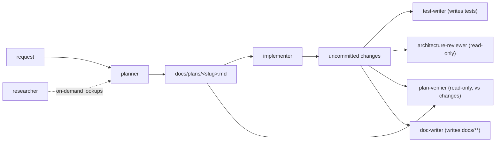

# Development Plan: Four new subagents (test-writer, architecture-reviewer, plan-verifier, doc-writer)

**Status:** Draft · **Date:** 2026-06-23 · **Modules:** `.claude/agents/` (meta — agent definitions, not product code)

## 1. Problem statement

DevDigest ships three subagents under `.claude/agents/` — `researcher` (read-only lookups),
`planner` (read-only plans), and `implementer` (writes code). The delegation surface has gaps: no
agent **writes tests**, no agent performs **architectural review**, no agent **verifies a plan was
actually implemented**, and no agent **writes documentation**. This adds those four, each as a
single self-contained Markdown agent file in the established house-style, so the orchestrator can
delegate test authoring, architecture review, plan-coverage verification, and documentation the same
way it already delegates planning and implementation.

This is a **meta task**: the deliverables are agent definition files, not product code. There is no
schema, no API, no migration, and no `pnpm test` to run. "Done" is **structural** — valid YAML
frontmatter, body that matches the house-style sections, declared-and-routed skills, correct tool
scoping (read-only agents grant no write tools), and an updated `.claude/agents/README.md` catalog +
Sources.

## 2. Scope

**In scope:**
- Four new agent files under `.claude/agents/`:
  - `test-writer.md` — WRITE access; authors UI (`client/`) and backend (`server/` + `reviewer-core/`) tests.
  - `architecture-reviewer.md` — READ-ONLY; architectural review (boundaries, dependencies, contracts, trust boundaries).
  - `plan-verifier.md` — READ-ONLY; requirements-traceability verification of a plan against the code written.
  - `doc-writer.md` — WRITE access (docs only); documents built features, converts plans to RFC/design docs, adds Mermaid diagrams.
- A single update to `.claude/agents/README.md`: a Catalog row per new agent, a "What the agents are based on" subsection per new agent, and an extended Sources list (matching the README's existing Sources style).

**Out of scope:**
- Any product code, schema, migration, or test of DevDigest itself. No `server/`, `client/`, `reviewer-core/`, or `e2e/` files are touched.
- Creating the `docs/` Diátaxis tree, `docs/adr/`, or `docs/rfcs/` directories. `doc-writer.md` only **describes** where docs go (a deterministic placement table); it does not scaffold the tree. The tree is created lazily when `doc-writer` first writes into it.
- Editing the existing three agent files (`researcher.md`, `planner.md`, `implementer.md`) — only the shared `README.md` is touched.
- Editing `*/src/vendor/*` or `client/messages/<locale>/*.json` (these are explicit do-not-touch zones the new agents must respect, but no edits are planned here).
- Wiring the agents into any harness/settings file. They are discovered from `.claude/agents/` by location, same as the existing three.

## 3. Affected modules & architectural impact

- **`.claude/agents/` (the only affected area):** four new sibling files + one edit to `README.md`. No DevDigest runtime module (`server` / `client` / `reviewer-core` / `e2e` / `shared`) changes. The agents *reference* those modules in their bodies (skill routing, do-not-touch rules, verification commands) but do not modify them.
- **House-style contract every new file must satisfy** (derived from `planner.md`, `implementer.md`, `researcher.md`):
  - **YAML frontmatter:** `name`; `description` written as a delegation router (prose + one or more `<example>` blocks each containing `Context:` / `user:` / `assistant:` and a `<commentary>` block); explicit `tools`; optional `skills:` list with `#` section comments grouping skills; `model`; `color`.
  - **Body sections (in this order):** an H1 title + one-paragraph role statement (incl. read-only/write posture) → **"The project (know this without re-reading)"** (the standalone-packages table + non-default facts, trimmed to what the agent needs) → a **skill-routing/usage table** → **"Core rules (non-negotiable)"** (numbered) → a **workflow** and/or **output format** → **"What you do NOT do"**.
  - **Tool scoping is the security boundary:** read-only agents (`architecture-reviewer`, `plan-verifier`) MUST list only `Read, Grep, Glob, Skill` (plus, for `plan-verifier`, `Bash` strictly to *run an existing test suite as read-only evidence* — call this out explicitly and forbid mutation). `test-writer` and `doc-writer` get write tools (`Read, Edit, Write, Grep, Glob, Skill, TodoWrite`; `test-writer` also `Bash` to run the suites it writes).
- **Architectural placement diagram** (to embed in the README "How they fit together" update — `doc-writer`/`mermaid-diagram` style):



## 4. Relevant INSIGHTS (distilled)

- **House-style is load-bearing and already proven.** The three existing agents are the spec; imitate their frontmatter and section structure exactly rather than inventing a new shape — `.claude/agents/{planner,implementer,researcher}.md`.
- **README is the single shared file.** It already has a Catalog table, a "What the agents are based on" section split per agent, and a Sources list with `[title](url) — note` bullets. New rows/subsections/sources must match that exact style — `.claude/agents/README.md`.
- **Vendored Zod contracts have no in-repo source** — they are duplicated into `client/src/vendor/shared` and `server/src/vendor/shared`. Any agent that mentions "edit at source" must note this nuance is aspirational; the working convention is editing both vendor copies. `test-writer` and `doc-writer` must still treat `*/src/vendor/*` as do-not-edit for *their* purposes.
- **Testing is typological, not exhaustive, and hermetic by default** — `server/src/adapters/mocks.ts` for unit; `*.it.test.ts` + testcontainers Postgres for integration (self-skip without Docker); RTL+jsdom for client; reviewer-core is a pure engine. `test-writer` must encode all of this — `TESTING.md`.
- **`server/package.json` is `skip-worktree`** — the unit/integration split is invoked via `pnpm exec vitest run --exclude '**/*.it.test.ts'` (unit) and `pnpm exec vitest run .it.test` (integration), not committed scripts. `test-writer` must use these exact invocations — `TESTING.md` (Conventions).
- **DevDigest already documents prompts as code** (`docs/agent-prompts/*.md` are the human-readable originals, DB is runtime source of truth). `doc-writer` should be consistent with this docs-as-code precedent — `docs/agent-prompts/`.

## 5. Phased task breakdown

Tasks 1–4 are **fully parallel** (four distinct new files, zero overlap). Task 5 is **sequential
after all of 1–4** because it is the only writer of the single shared file `README.md`. No two tasks
share a file.

---

### Task 1 — `test-writer.md` (write-access test-authoring agent)  ·  [parallel-track: A]

- **Module(s):** `.claude/agents/` (meta)
- **Files (no overlap with other parallel tasks):**
  - `.claude/agents/test-writer.md` — **new**
- **Skills to apply (for authoring this agent file):** `typescript-expert` (frontmatter/router prose precision), `mermaid-diagram` (optional, only if a diagram clarifies the test-trophy). The skills the *agent itself declares and routes to* are listed below.
- **Frontmatter shape to encode:**
  - `name: test-writer`
  - `description:` delegation router prose + ≥2 `<example>` blocks: (a) a UI test request ("write tests for the PR-review findings list component") routing to RTL+jsdom; (b) a backend test request ("add an integration test for the agents CRUD route") routing to Fastify `.inject()` / testcontainers. Each with a `<commentary>` noting module → skill routing and the "never weaken an assertion" rule.
  - `tools: Read, Edit, Write, Grep, Glob, Bash, Skill, TodoWrite`
  - `skills:` (with `#` section comments) — `# Frontend / UI` → `react-testing-library`; `# Backend / engine` → `fastify-best-practices`; `# Full-stack (always)` → `zod`, `typescript-expert`, `security`.
  - `model: sonnet` · `color:` pick an unused color (existing: purple/green/cyan — use e.g. `yellow`).
- **Body sections it must contain:** role paragraph (writes tests for UI **and** backend; clarify "JoAi" = the UI/frontend, and that `reviewer-core` is backend regardless) → "The project (know this without re-reading)" (standalone-packages table + the **suite map** from TESTING.md: client=RTL+jsdom fetch-mocked, server-unit=hermetic via `src/adapters/mocks.ts`, server-integration=`*.it.test.ts` real Postgres via testcontainers self-skipping without Docker, reviewer-core=pure engine) → a **skill-routing table** (editing `client/` tests → `react-testing-library`; `server/` route/engine tests → `fastify-best-practices`; always → `zod`, `typescript-expert`, `security`) → "Core rules" → workflow → "What you do NOT do".
- **Best-practices points to encode (from the gathered research):**
  - Give the agent a **runnable check**: it must run the suite it writes and report results (Claude Code sub-agents / best-practices docs).
  - **Characterization vs TDD:** characterization/approval tests for already-built code; red-green TDD when authoring tests alongside new code.
  - **Test the two users** (end-user + dev-user), not internals; **use-case coverage over line coverage** (Kent C. Dodds; mirrors TESTING.md "typological").
  - **RTL discipline:** `getByRole` first / `getByTestId` last; `userEvent` over `fireEvent`; no assertion-free `get*` calls (every query that asserts existence must be wrapped in `expect()`); no empty `waitFor`.
  - **Mock the process boundary** (network/FS/clock/external API), not your own internals — for DevDigest that means `src/adapters/mocks.ts` (MockLLMProvider, MockGitClient), `fetch` mocking on the client, MSW where appropriate; "if refactoring internals breaks the test, you're testing implementation details" (Fowler "Mocks Aren't Stubs"; Vitest testing-in-practice).
  - **Fastify testing via `.inject()`**; **testcontainers Postgres** for `*.it.test.ts`; respect the `skip-worktree` split invocation (`pnpm exec vitest run --exclude '**/*.it.test.ts'` / `pnpm exec vitest run .it.test`).
  - **The load-bearing rule:** never weaken/delete an assertion to make a test pass; never edit product code solely to accommodate a test — if a test fails, fix the code or **report the bug** (do not silently change product behavior). State that this agent's mandate is tests; production-code edits to make a legitimate test pass are out of its lane and must be reported.
  - Respect do-not-touch: never write tests into `*/src/vendor/*`; never edit `client/messages/<locale>/*.json`; never `docker compose down -v`.
- **Done when:** file exists with valid frontmatter (router `description` + `<example>`/`<commentary>`, `tools` includes `Edit/Write/Bash`, `skills` declared with section comments, `model: sonnet`, a `color`); body has all required house-style sections; every declared skill (`react-testing-library`, `fastify-best-practices`, `zod`, `typescript-expert`, `security`) is also referenced in the body routing table; TESTING.md facts (suite map, hermetic mocks, `.it.test.ts` split, RTL+jsdom) are reproduced; the never-weaken-assertion / never-edit-product-code-to-pass rule is present; do-not-touch zones are stated.

---

### Task 2 — `architecture-reviewer.md` (read-only architectural review agent)  ·  [parallel-track: B]

- **Module(s):** `.claude/agents/` (meta)
- **Files (no overlap):**
  - `.claude/agents/architecture-reviewer.md` — **new**
- **Skills to apply (for authoring):** `typescript-expert`, `mermaid-diagram` (a C4 Container/Component sketch can illustrate "review at the right altitude").
- **Frontmatter shape to encode:**
  - `name: architecture-reviewer`
  - `description:` router prose + ≥2 `<example>` blocks: (a) "review the architecture of the new review-budget feature across server/ and reviewer-core/" → boundaries/dependency-direction review; (b) a counter-example clarifying it is **not** a line-style nitpick or full security audit (delegate those elsewhere). `<commentary>` notes read-only posture and severity grouping.
  - `tools: Read, Grep, Glob, Skill` — **no write tools, no Bash** (prefer none; state read-only is enforced by tool scoping).
  - `skills:` `# Full-stack (always)` → `typescript-expert`, `security` (security only as a *trust-boundary lens*, not a full audit); `# Backend` → `postgresql-table-design`, `drizzle-orm-patterns` (for data-layer contract/boundary review), `fastify-best-practices` (plugin encapsulation / boundary review); `# Shared` → `mermaid-diagram`.
  - `model: opus` · `color:` unused (e.g. `red`).
- **Body sections:** role paragraph (architectural review; explicitly **read-only**, never writes/mutates; explicitly **not** line-level style and **not** a full security audit) → "The project (know this without re-reading)" (standalone packages, cross-package via tsconfig path aliases, vendored shared contracts, the layering server↔reviewer-core↔client) → a skill-usage table (which lens each skill provides) → "Core rules" → an **output format** (a review report grouped by severity **Critical / Important / Minor**, each finding anchored to `file:line`, ending with a **recommendation, not a rewrite**) → "What you do NOT do".
- **Best-practices points to encode:**
  - **Read-only enforced by tool scoping** — the agent *cannot* write regardless of prompt wording; state this. Fresh/isolated context; "the author isn't the best critic."
  - **What to evaluate:** separation of concerns, dependency inversion/direction, bounded contexts, coupling/cohesion, layer violations, contract design, trust boundaries (Microsoft .NET architectural principles; SOLID at architecture scale; Fowler modular architecture).
  - **Altitude:** review at **C4 Container/Component** level, not Code-level nitpicks; use ADRs to check for architectural drift.
  - **Anti-scope-creep / judgment over rules:** classify findings; do **not** flag patterns that are consistent with the surrounding codebase (Fowler "encoding team standards"). Severity **Critical/Important/Minor**; output a **recommendation, not a rewrite**.
  - Respect DevDigest's actual boundaries: reviewer-core is a **pure engine** (no DB/GitHub/FS) — flag any dependency leaking into it; vendored shared contracts are the cross-package boundary.
- **Done when:** file exists; frontmatter valid; `tools` is exactly `Read, Grep, Glob, Skill` (**grants no write/Bash tool** — this is a hard acceptance check); body states read-only-never-mutate and the explicit non-goals (no style nitpicking, no full security audit); output format uses Critical/Important/Minor with `file:line` anchors and recommendation-not-rewrite; declared skills are referenced in the body lens table.

---

### Task 3 — `plan-verifier.md` (read-only requirements-traceability agent)  ·  [parallel-track: C]

- **Module(s):** `.claude/agents/` (meta)
- **Files (no overlap):**
  - `.claude/agents/plan-verifier.md` — **new**
- **Skills to apply (for authoring):** `typescript-expert`, `mermaid-diagram` (optional — a traceability flow).
- **Frontmatter shape to encode:**
  - `name: plan-verifier`
  - `description:` router prose + ≥2 `<example>` blocks: (a) "verify that everything in docs/plans/review-budget.md was actually built" → per-"Done when" coverage check; (b) a scope-creep example (work present with no matching requirement). `<commentary>` stresses evidence-based, never-guess, "no evidence = NOT met."
  - `tools: Read, Grep, Glob, Skill, Bash` — `Bash` allowed **only** to run an *existing* test suite as read-only evidence (e.g. `pnpm test`); state it must never mutate code, schema, or data, and never run migrations or `docker compose down -v`.
  - `skills:` `# Full-stack (always)` → `typescript-expert`, `zod`, `security` (verifying contract/validation criteria); `# Shared` → `mermaid-diagram`.
  - `model: opus` · `color:` unused (e.g. `orange`).
- **Body sections:** role paragraph (GIVEN a plan + the code already written, verify **every** requirement / "Done when" criterion was met; read-only; evidence-based) → "The project (know this without re-reading)" (where plans live: `docs/plans/<slug>.md`; per-module verify commands; the `*.it.test.ts` split if it runs a suite as evidence) → a skill-usage table → "Core rules" → an **output format** = a **requirements-traceability / coverage report**: one row per criterion with status **Met / Partially met / Not met / No evidence**, each Met/Partial backed by a `file:line` citation or a named passing test; plus a **scope-creep** section (work found with no matching requirement) → "What you do NOT do".
- **Best-practices points to encode:**
  - **Verification vs validation** ("are we building it right?" vs "the right thing?") — this agent does **verification against the spec**, not validation of the spec's goodness (IEEE/ISTQB).
  - **Requirements Traceability Matrix** with coverage states Covered/Partially/Not covered; **backward traceability** to detect scope creep (TestRail, Jama, ReqView, Visure).
  - **Acceptance criteria vs Definition of Done**; ATDD framing.
  - **Evidence-based, no-guess:** cite `file:line` or a passing test per criterion; **"absence of evidence is itself a finding"** → status **No evidence** (never silently assume Met). Separate validator from author (the author isn't the best judge of their own coverage). Verifiable criteria / spec conformance.
  - **Scope boundary:** this agent checks **requirement coverage & correctness-against-spec only** — it does **not** assess general best practices or architecture (that is `architecture-reviewer`'s lens) and does not write tests (that is `test-writer`).
- **Done when:** file exists; frontmatter valid; `tools` grants **no Edit/Write** (Bash present but explicitly read-only-evidence-only — acceptance check: body forbids any mutation/migration); output format has the four-state per-criterion table (Met/Partially met/Not met/No evidence) with mandatory citation-or-test evidence and a scope-creep section; the "no evidence ≠ met, never guess" rule is explicit; declared skills referenced in body.

---

### Task 4 — `doc-writer.md` (write-access documentation agent, docs only)  ·  [parallel-track: D]

- **Module(s):** `.claude/agents/` (meta)
- **Files (no overlap):**
  - `.claude/agents/doc-writer.md` — **new**
- **Skills to apply (for authoring):** `mermaid-diagram` (this agent's primary declared skill), `typescript-expert`.
- **Frontmatter shape to encode:**
  - `name: doc-writer`
  - `description:` router prose + ≥2 `<example>` blocks: (a) "document the finished review-budget feature" → present-tense reference/how-to docs; (b) "turn docs/plans/review-budget.md into a design doc" → forward-looking RFC/design doc. `<commentary>` notes write-scope is docs only, and diagrams via Mermaid.
  - `tools: Read, Edit, Write, Grep, Glob, Skill, TodoWrite`
  - `skills:` `# Shared` → `mermaid-diagram`; `# Full-stack (always)` → `typescript-expert`, `security` (so generated docs don't leak secrets / unsafe examples).
  - `model: sonnet` · `color:` unused (e.g. `blue`).
- **Body sections:** role paragraph (documents already-built features, converts plans → forward-looking RFC/design docs, turns handed-in material into docs **with Mermaid diagrams**; write-scope is **docs only**) → "The project (know this without re-reading)" (standalone packages; docs-as-code precedent in `docs/agent-prompts/`; where it MAY write vs MUST NOT) → a **deterministic placement decision table** (input-type → Diátaxis type → location) → a **skill-usage table** (routing `mermaid-diagram` by diagram type) → "Core rules" → "What you do NOT do".
- **Best-practices points to encode:**
  - **Diátaxis** four types on reader-intent axes (tutorials / how-to / reference / explanation); **never mix types on one page**; **explanation requires grounded/post-implementation understanding** → write explanation for **built** code, not for plans.
  - **Docs-as-code:** Markdown, in-repo, PR-reviewed, **lowercase-hyphen filenames**.
  - **Mermaid diagrams-as-code:** flowchart=process, sequence=service interactions, ER=schema, architecture/C4=system structure, state=lifecycle; **embed in the Markdown so it diffs in PRs**. Route by diagram type (from the `mermaid-diagram` skill's decision guide).
  - **Deterministic placement table** (the load-bearing artifact for this agent):

    | Input / intent | Diátaxis type | Tense | Location |
    |---|---|---|---|
    | Learning-oriented walkthrough | Tutorial | present | `docs/tutorials/<name>.md` |
    | Task / goal recipe | How-to | present | `docs/how-to/<name>.md` |
    | Spec of an existing API/contract/CLI | Reference | present | `docs/reference/<name>.md` |
    | Conceptual understanding of built behavior | Explanation | present | `docs/explanation/<name>.md` |
    | An accepted architectural decision | ADR | present/past | `docs/adr/NNNN-verb-noun.md` |
    | A plan (`docs/plans/<slug>.md`) → forward-looking proposal | RFC / design doc | **future** | `docs/rfcs/<slug>.md` (or `docs/design/<slug>.md`) |
    | Repo / package overview | README | present | repo root `README.md` / package `README.md` |

  - **Style (Google developer documentation style guide):** 2nd person, active voice, present tense, no "simply/just". Forward-looking plans use **future tense** (RFC); built features use **present tense**.
  - **Write boundaries (call out explicitly):** MAY write under `docs/**` and package `README.md`s. MUST NOT write `*/src/vendor/*` (vendored) or `client/messages/<locale>/*.json` (translations); MUST NOT edit product source or tests (that's `implementer` / `test-writer`); never `docker compose down -v`.
- **Done when:** file exists; frontmatter valid (`tools` includes `Edit/Write/TodoWrite`, `skills` includes `mermaid-diagram` + always-on set, `model: sonnet`, a color); body contains the deterministic input→Diátaxis→location placement table; states allowed write paths (`docs/**`, package `README.md`) and forbidden paths (vendored, translations, product source/tests); Diátaxis "don't mix types / explanation = built code", docs-as-code lowercase-hyphen filenames, Mermaid-embedded-in-Markdown, and the present-vs-future tense rule are all present; `mermaid-diagram` is referenced in the body routing table.

---

### Task 5 — Update `.claude/agents/README.md` catalog, "based on", and Sources  ·  [sequential-after: Tasks 1–4]

- **Module(s):** `.claude/agents/` (meta)
- **Files (no overlap — this is the ONLY task that edits README.md):**
  - `.claude/agents/README.md` — **edit:** (1) add four Catalog rows; (2) update the "How they fit together" diagram/prose to include the new agents (the Mermaid flow in §3); (3) add a "What the agents are based on" subsection per new agent; (4) extend the Sources list.
- **Skills to apply:** `mermaid-diagram` (the "How they fit together" diagram), `typescript-expert` (consistent prose).
- **Depends on:** Tasks 1–4 (the four files must exist so the Catalog links resolve and the descriptions are accurate). Sequenced last so no parallel track collides on `README.md`.
- **What to add (match existing README style exactly — `[name](file.md)` links, `| … |` table rows, `[title](url) — note` Sources bullets):**
  - **Catalog rows** (one per agent), in the existing table format `| Agent | Model | Tools | What it does |`:
    - `test-writer` — sonnet — `Read, Edit, Write, Grep, Glob, Bash, Skill, TodoWrite` — authors UI + backend tests, routes RTL/Fastify skills, never weakens assertions.
    - `architecture-reviewer` — opus — read-only (`Read, Grep, Glob, Skill`) — architectural review (boundaries/contracts/trust boundaries), severity-grouped, recommendation not rewrite.
    - `plan-verifier` — opus — read-only + Bash-for-evidence (`Read, Grep, Glob, Skill, Bash`) — requirements-traceability of a plan vs the code, evidence-based, no guessing.
    - `doc-writer` — sonnet — `Read, Edit, Write, Grep, Glob, Skill, TodoWrite` — docs-only writer (Diátaxis + ADR/RFC placement, Mermaid diagrams).
  - **"What the agents are based on"** — one subsection per new agent, summarizing the encoded best-practices (1–2 sentences + bullets), mirroring the existing `### planner & implementer` / `### researcher` structure.
  - **Sources** — append, grouped per new agent, in the existing `- [Title](URL) — short note` style, reproducing the gathered lists:
    - *test-writer:* Claude Code sub-agents docs; Claude Code best-practices; characterization-vs-TDD (understandlegacycode); Kent C. Dodds (testing implementation details / how to know what to test / common RTL mistakes); Testing Library query priority; Fowler "Mocks Aren't Stubs"; Vitest testing-in-practice; Fastify `.inject()` testing guide; Testcontainers Postgres.
    - *architecture-reviewer:* foojay.io agents/subagents/skills/MCP; Microsoft .NET architectural principles; SOLID-still-the-foundation (Stack Overflow blog); Fowler modular architecture; C4 model; Fowler ADR; Fowler "encoding team standards".
    - *plan-verifier:* Verification & validation (Wikipedia); IEEE 1012; TestRail RTM; Jama RTM; ReqView coverage gaps; Visure requirements coverage; AltexSoft acceptance-criteria vs DoD; Agile Alliance ATDD; dev.to "how I validate quality"; Hyperproof gap assessment; BrainGrid verifiable acceptance criteria; Addy Osmani good spec.
    - *doc-writer:* Diátaxis (+ the four quadrant pages); Write the Docs docs-as-code; APIdog docs-as-code; Mermaid intro + syntax pages; Nygard ADR; joelparkerhenderson ADR; Pragmatic Engineer RFC/design docs; Lambros Petrou RFC template; Google developer documentation style guide (highlights + tone).
- **Done when:** README has exactly four new Catalog rows with working relative links to the four new files; the "How they fit together" section reflects the new agents; there is a "based on" subsection per new agent; the Sources list contains the per-agent source bullets in the existing format; no other section is broken and the three existing agents' rows/sections are unchanged.

## 6. Testing strategy

This is a meta task — there is no `pnpm test`. Verification is **structural** and done per file. For each of Tasks 1–4 the implementer self-checks:

1. **Frontmatter parses as valid YAML** and contains: `name` (matches filename), `description` (router prose + ≥1 `<example>` with `<commentary>`), `tools` (exact set per task), `skills` (with `#` section comments), `model`, `color` (unique vs purple/green/cyan and the other new files).
2. **Tool scoping check (security boundary):** `architecture-reviewer` and `plan-verifier` grant **no `Edit`/`Write`**; `plan-verifier`'s `Bash` is documented as read-only-evidence-only; `test-writer`/`doc-writer` correctly have write tools.
3. **House-style body sections present** in order: role paragraph (with read-only/write posture) → project facts → skill table → Core rules → workflow/output format → "What you do NOT do".
4. **Skills declared == skills routed:** every skill in `skills:` frontmatter appears in the body routing/usage table, and vice versa.
5. **Encoded best-practices present:** spot-check that each agent's required points (Task's "Done when" list) appear in the body.

For Task 5: confirm the four Catalog links resolve to existing files, the Sources bullets match the existing format, and no existing content regressed (diff is additive except the "How they fit together" update).

A light cross-file lint (`grep` for `name:`, `tools:`, `model:`, `<example>`, `## What you do NOT do` across all four new files) gives a fast structural pass/fail.

## 7. Risks & mitigations

- **Risk: house-style drift** (an agent invents new sections or omits the router `description`). *Mitigation:* each task names the three reference files and the exact required sections; Task verification step 3 checks them.
- **Risk: a read-only agent accidentally granted a write tool.** *Mitigation:* explicit hard acceptance check (verification step 2) on `architecture-reviewer` and `plan-verifier` tool lists; bodies state read-only-never-mutate.
- **Risk: `color` collision** across agents. *Mitigation:* existing colors are purple (planner), green (implementer), cyan (researcher); plan assigns distinct suggestions (yellow/red/orange/blue) — implementers confirm uniqueness.
- **Risk: declared-but-unrouted skills** (skill in frontmatter never referenced in body, or vice versa). *Mitigation:* verification step 4.
- **Risk: doc-writer placement table references trees that don't exist yet** (`docs/adr/`, `docs/rfcs/`). *Mitigation:* this is intentional and in-scope-as-described — the table is a *decision guide*; `doc-writer` creates a directory lazily on first write. The plan states the tree is not scaffolded here.
- **Risk: README merge conflict** if Task 5 runs before 1–4 finish. *Mitigation:* Task 5 is strictly sequenced after all four and is the sole editor of `README.md`.
- **Risk: stale Sources URLs.** *Mitigation:* the URLs are reproduced verbatim from the gathered research; if any 404s, the implementer notes it rather than inventing a replacement.

## 8. End-to-end verification

There is no application to boot. The end-to-end check is structural and runnable as shell/read steps:

```sh
# 1. All four new files exist alongside the three originals.
ls .claude/agents/*.md
#   expect: README.md architecture-reviewer.md doc-writer.md implementer.md \
#           plan-verifier.md planner.md researcher.md test-writer.md

# 2. Each new file has the required frontmatter keys and a "do NOT" section.
for f in test-writer architecture-reviewer plan-verifier doc-writer; do
  echo "== $f =="
  grep -E '^(name|tools|model|color):' ".claude/agents/$f.md"
  grep -c '<example>' ".claude/agents/$f.md"          # expect >= 1
  grep -q '## What you do NOT do' ".claude/agents/$f.md" && echo "do-not section OK"
done

# 3. Read-only agents grant NO write tools (must print nothing).
grep -nE '^tools:.*(Edit|Write)' .claude/agents/architecture-reviewer.md .claude/agents/plan-verifier.md
#   expect: (no output)

# 4. README catalog links resolve and Sources updated.
grep -E '\[(test-writer|architecture-reviewer|plan-verifier|doc-writer)\]\(' .claude/agents/README.md
#   expect: four Catalog rows
```

Manual final pass: open each new file, confirm (a) the `description` reads as a delegation router with `<example>`/`<commentary>` blocks, (b) skills declared == skills routed in the body table, (c) the agent-specific best-practices points from §5 are present, and (d) the README "based on" subsections + per-agent Sources match the existing README style. When all four files pass the structural checks and the README catalog/sources are updated without regressing the existing three agents, the feature is complete.
