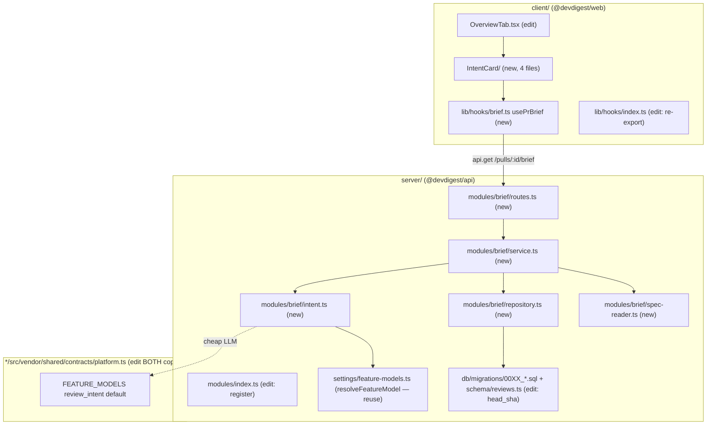

# Development Plan: PR Brief (Intent Layer first)

**Status:** Draft · **Date:** 2026-06-23 · **Modules:** server, client, shared (vendored), reviewer-core (decision only)

## 1. Problem statement

Add a **PR BRIEF** panel to the PR Overview page in the studio. The brief is a single composed contract `PrBrief { intent, blast, risks, history }` (already defined — see below) served by **one aggregating server module** `brief` at `GET /pulls/:id/brief`, cached in the existing `pr_brief` table. The card renders **incrementally** — each section (Intent, Risks, Blast Radius, History) appears as it becomes available.

**Phase 1 = the Intent Layer** (the named feature, full vertical slice):
- A cheap LLM derives the PR's **intent statement**, **in-scope** and **out-of-scope** lists.
- Motivation sources, in priority order, with **graceful degradation**:
  1. **Linked issue** body (`PrDetail.linked_issue`, fetched live by Octokit via the `closes/fixes #N` regex — NOT persisted).
  2. **Referenced spec** — a `code_chunks` row with `source = 'spec'` (no read helper exists yet → one must be added).
  3. **Implicit signals only** — when the PR has no linked issue and no spec, intent MUST still be inferred from the **PR title + body (`pull.body`) + the unified diff**. This fallback is an explicit product requirement, not an error path.
- The result is persisted/cached into `pr_brief.json` (a partial `PrBrief` with only `intent` populated in Phase 1), surfaced by `GET /pulls/:id/brief`, consumed by a new `usePrBrief` hook, and rendered as an **INTENT card** on the Overview tab.

Later phases add **Risks**, **Blast Radius**, and **History** sections to the same brief/endpoint/card without rebuilding Phase 1.

## 2. Scope

**In scope (Phase 1 — Intent Layer):**
- Flip the `review_intent` registry default to a cheap model.
- A spec-reader query over `code_chunks` (`source = 'spec'`).
- An intent service that resolves its model via `resolveFeatureModel(..., 'review_intent')`, builds a fenced/untrusted prompt, calls `completeStructured({ schema: Intent })`, and returns a validated `Intent`.
- A new `brief` server module: `routes.ts` + `service.ts` + `repository.ts`, registered in `modules/index.ts`, exposing `GET /pulls/:id/brief`.
- `pr_brief` staleness handling via a new `head_sha` column (migration) + read-time comparison against `pull.headSha`.
- Client `usePrBrief(prId)` hook + `IntentCard` component (4-file convention) rendered on `OverviewTab`.
- Tests at each layer.

**In scope (Phase 2+ — separate non-overlapping tracks):**
- **Risks** section (LLM, `risk_brief` feature model) → `brief.json.risks`.
- **Blast Radius** mapper (no LLM) producing `BlastRadius.downstream: DownstreamImpact[]` + the `BlastRadiusCard`.
- **PR History** section → `brief.json.history`.

**Out of scope (explicit):**
- **No** edits to `client/messages/<locale>/*.json` translation files (the `brief.json` and `blast.json` namespaces already exist — reuse their keys; any genuinely new key goes in a NEW namespace file, never by editing the existing ones).
- **No** new Smart Diff work (the `SmartDiff` contract exists but is not part of PR Brief composition).
- **No** changes to the existing intent derivation already done inside the review run pipeline (`reviews/run-executor.ts`) — the new `brief` module owns its own intent path and must not couple to a review run.
- **No** `docker compose down -v`.
- **No** SSE for the brief — plain JSON + TanStack Query.
- **No** rebuild of: Settings model-selection UI/backend, the `Intent`/`BlastRadius`/`Risks`/`PrHistory`/`PrBrief` contracts, the `pr_brief` table itself, or the `brief.json`/`blast.json` i18n namespaces — **all ALREADY DONE**.

## 3. Affected modules & architectural impact



- **shared (vendored):** one-line value change to the `review_intent` default in `FEATURE_MODELS`. Per the repo INSIGHTS (`2026-06-18`, root `INSIGHTS.md`), `@devdigest/shared` has **no in-repo source** — the alias points each package at its own vendored copy. The change MUST be applied **identically to BOTH** `server/src/vendor/shared/contracts/platform.ts` **and** `client/src/vendor/shared/contracts/platform.ts`. This is one atomic task so two parallel tasks never touch the same file independently.
- **server:** new `brief` module (4 new files + 2 small edits to existing files). A schema change to `pr_brief` (add `head_sha`) → new migration. Reuses `resolveFeatureModel`, `loadDiff`, `getPull`, `getContext`, `container.llm`, `completeStructured`, and the `upsertIntent` on-conflict template as a model.
- **client:** new `IntentCard` (4-file), new `usePrBrief` hook, edit `OverviewTab.tsx` to render the card, edit `hooks/index.ts` barrel.
- **reviewer-core:** no code change. A **decision** only (Task 3): reuse `wrapUntrusted` (already exported) for untrusted-content fencing in the intent prompt vs. a dedicated minimal prompt. Recommendation below.

## 4. Relevant INSIGHTS (distilled)

Cross-cutting:
- **Vendored shared has no source** — edit BOTH vendor copies identically; "edit at source" is aspirational here (root `INSIGHTS.md`, 2026-06-18). Affects Task 1 only.
- **Migrations are NOT applied on boot** — any schema change needs an explicit `cd server && pnpm db:migrate` step (`CLAUDE.md`, `server/CLAUDE.md`).
- **Pricing slug exact-match gotcha** — `estimateCost` matches the PRICING slug exactly; a provider-prefixed string like `openrouter/deepseek-v4-flash` misses the key `deepseek/deepseek-v4-flash` and the cost badge shows "—" (`server/INSIGHTS.md`, 2026-06-18). The existing `onboarding` feature default is `provider: 'openrouter', model: 'deepseek/deepseek-v4-flash'` (NOTE the slug is **`deepseek/deepseek-v4-flash`**, not `openrouter/deepseek-v4-flash`). Use the **same shape** for `review_intent`: `defaultProvider: 'openrouter'`, `defaultModel: 'deepseek/deepseek-v4-flash'`.

Server:
- **Prompt-injection defense is one shared trusted rule, not text parsing** (`server/INSIGHTS.md`). `INJECTION_GUARD`/`wrapUntrusted` (reviewer-core `prompt.ts`) treat untrusted content as data. PR body + issue body are author-controlled and UNTRUSTED.
- **Repo Intel degrades silently when unindexed** — relevant to Phase 2 Blast Radius (crons only populate on the persistent-index path).
- **Cost is computed on read, never persisted** — not directly needed for the brief, but don't add a cost column.

Client:
- **Vendored UI + shared are edit-at-source / do-not-touch** (`client/CLAUDE.md`).
- **`useTranslations("<namespace>")`** is the i18n entry (e.g. `SettingsModels.tsx:21`). Components funnel data through `lib/hooks` → `api.ts` only; never fetch directly.

## 5. Phased task breakdown

> Dependency order: **Task 1 (shared default)** and **Task 2 (migration)** are the foundation and must land first. **Task 3 (intent service)**, **Task 4 (brief module/endpoint)** are sequential on the server side (Task 4 imports Task 3). **Task 5 (client hook + card)** depends on the endpoint shape from Task 4 but can start against the agreed contract once Task 1 lands. Phases 2+ (Tasks 6–8) start only after Phase 1 is merged.

---

### Task 1 — Flip `review_intent` to the cheap default (vendored shared) · [sequential-first; blocks all]
- **Module(s):** shared (vendored into server + client)
- **Files (no overlap with other parallel tasks):**
  - `server/src/vendor/shared/contracts/platform.ts` — edit: in `FEATURE_MODELS`, change the `review_intent` entry from `defaultProvider: 'openai', defaultModel: 'gpt-4.1'` to `defaultProvider: 'openrouter', defaultModel: 'deepseek/deepseek-v4-flash'` (mirror the existing `onboarding` entry shape exactly — note the slug `deepseek/deepseek-v4-flash`, NOT `openrouter/...`).
  - `client/src/vendor/shared/contracts/platform.ts` — edit: **identical** change.
- **Skills to apply:** zod, typescript-expert, security
- **Relevant INSIGHTS:** vendored-shared edit-BOTH-copies rule; pricing exact-slug gotcha (use `deepseek/deepseek-v4-flash`).
- **Done when:**
  - Both files changed identically; `review_intent` stays in `FEATURE_MODELS` (still selectable in Settings — no UI change).
  - `cd server && pnpm typecheck` and `cd client && pnpm typecheck` pass.
  - No other field changed (label/description/id untouched).

---

### Task 2 — `pr_brief` staleness column + migration · [parallel-track: A]
- **Module(s):** server
- **Files (no overlap):**
  - `server/src/db/schema/reviews.ts` — edit: add `headSha: text('head_sha')` (nullable — backfill-safe, no volatile default) to the `prBrief` table definition only. Do not touch `prIntent`/`reviews`/`findings`.
  - `server/src/db/migrations/00XX_<generated>.sql` — **new**: `ALTER TABLE "pr_brief" ADD COLUMN "head_sha" text;` Generate via `cd server && pnpm db:generate` (drizzle-kit) so the journal/meta snapshot stays consistent; do NOT hand-author the meta files.
- **Skills to apply:** drizzle-orm-patterns, postgresql-table-design, typescript-expert, security
- **Relevant INSIGHTS:** migrations are NOT applied on boot — the plan's verification runs `pnpm db:migrate`. Nullable column avoids a table rewrite (postgresql-table-design: non-volatile/omitted default is fast).
- **Done when:**
  - `pnpm db:generate` produces exactly one new migration adding the nullable `head_sha`; meta snapshot updated by the tool.
  - `cd server && pnpm db:migrate` applies cleanly against the dev Postgres.
  - `cd server && pnpm typecheck` passes; the `prBrief` insert/select types now include `headSha`.

---

### Task 3 — Intent service + spec-reader · [sequential-after: Task 1]
- **Module(s):** server (engine logic stays server-side; no reviewer-core edit)
- **Files (no overlap):**
  - `server/src/modules/brief/intent.ts` — **new**: `deriveIntent(container, workspaceId, { pull, repo, diff, linkedIssueBody, specChunks })` →
    - resolve model: `const { provider, model } = await resolveFeatureModel(container, workspaceId, 'review_intent')` (never hardcode);
    - `const llm = await container.llm(provider)`;
    - build messages: a trusted system instruction describing the intent task + **fence ALL untrusted inputs** (PR title, `pull.body`, linked-issue body, spec chunks, diff) with `wrapUntrusted(label, content)` from `@devdigest/reviewer-core`. Recommended: **reuse `reviewer-core`'s `wrapUntrusted` only** (it is already exported and battle-tested) and write a small dedicated system prompt here — do NOT route through `assemblePrompt`/`reviewPullRequest`, because that path is review-shaped (system prompt, grounding, findings schema) and would couple the brief to a review run. Justification: the intent task returns the `Intent` schema, not `Review`; grounding does not apply; a dedicated ~15-line prompt keeps the cheap call lean and the module self-contained.
    - call `llm.completeStructured({ model, schema: Intent, schemaName: 'Intent', messages, maxRetries: 1 })` and return `result.data` (the provider+`parseWithRepair` already validate against the Zod `Intent` schema).
    - **Graceful degradation:** the prompt must explicitly instruct the model to infer intent from title/body/diff alone when no issue/spec is present; when issue/spec are present, prefer them. Never throw on missing motivation sources.
  - `server/src/modules/brief/spec-reader.ts` — **new**: `getSpecChunks(db, workspaceId, repoId, opts?)` → Drizzle select over `t.codeChunks` where `workspaceId`, `repoId`, and `source = 'spec'` (the enum already includes `'spec'` per `db/schema/context.ts`). Return `{ path, content }[]`, capped to a small N and total chars to protect the token budget. This is the only new read helper for specs.
- **Skills to apply:** fastify-best-practices (service shape), drizzle-orm-patterns, zod, typescript-expert, security
- **Relevant INSIGHTS:** untrusted-content fencing is the one shared defense — PR body + issue body are UNTRUSTED, wrap them; pricing-slug gotcha already handled by Task 1's default.
- **Done when:**
  - Unit test (hermetic, mock `container.llm` returning a stubbed `completeStructured`) covers: (a) issue-present path, (b) spec-present path, (c) **implicit-only fallback** (no issue, no spec) still returns a valid `Intent`.
  - All untrusted strings pass through `wrapUntrusted`; the system prompt contains the do-not-descope instruction.
  - `cd server && pnpm exec vitest run --exclude '**/*.it.test.ts'` passes for the new files; `pnpm typecheck` passes.

---

### Task 4 — `brief` module: endpoint, service aggregation, repository (persist/cache `pr_brief`) · [sequential-after: Task 2, Task 3]
- **Module(s):** server
- **Files (no overlap):**
  - `server/src/modules/brief/repository.ts` — **new**: `getBrief(db, prId)` → reads `pr_brief` row (`{ json, headSha }`); `upsertBrief(db, prId, json, headSha)` → `insert ... onConflictDoUpdate({ target: t.prBrief.prId, set: { json, headSha } })`, modeled on `upsertIntent` in `reviews/repository/pull.repo.ts:49`. Also a thin `getPull` reuse or import from the reviews repo is acceptable — but to avoid cross-module file coupling, call the existing `getContext` + a local pull lookup via `container.db` (mirror `pulls/routes.ts:185` select with workspace scoping).
  - `server/src/modules/brief/service.ts` — **new**: `getOrBuildBrief(container, workspaceId, prId)`:
    1. resolve pull (workspace-scoped) → 404 via `NotFoundError` if absent; resolve repo row.
    2. read cached brief; if present AND `cached.headSha === pull.headSha`, return it (fresh).
    3. else build: `loadDiff(container, repo, workspaceId, pull, repoRow)` (reuse `reviews/diff-loader.ts`); fetch linked issue body live (best-effort via `container.github().getPullRequest(...)` → `detail.linked_issue?.body`, swallow errors → undefined); `getSpecChunks(...)` (Task 3). Call `deriveIntent(...)` (Task 3).
    4. compose a **partial** `PrBrief` JSON: `{ intent }` in Phase 1 (Risks/Blast/History added in later phases — store empties or omit per the contract; see Risks §7). Persist via `upsertBrief(db, prId, json, pull.headSha)` and return it.
  - `server/src/modules/brief/routes.ts` — **new**: default Fastify plugin, `app.withTypeProvider<ZodTypeProvider>()`, `app.get('/pulls/:id/brief', { schema: { params: IdParams } }, async (req) => { const { workspaceId } = await getContext(container, req); return service.getOrBuildBrief(container, workspaceId, req.params.id); })`. Zod params → 422 on invalid input automatically. Consider a per-route rate limit (the build path can call the LLM) mirroring `reviews/routes.ts:29` (`{ rateLimit: { max: 10, timeWindow: '1 minute' } }`).
  - `server/src/modules/index.ts` — edit: one import `import brief from './brief/routes.js';` + one entry `brief,` in the `modules` registry. (This is the ONLY shared-file edit; sequence after the module files exist so there's no dangling import.)
- **Skills to apply:** fastify-best-practices, drizzle-orm-patterns, postgresql-table-design, zod, typescript-expert, security
- **Relevant INSIGHTS:** head_sha staleness — compare stored vs `pull.headSha` on read (Task 2 added the column); `pr_brief.json` is `jsonb` with `prId` PK (upsert template = `upsertIntent`); migrations not on boot.
- **Done when:**
  - Integration test `server/src/modules/brief/*.it.test.ts` (testcontainers Postgres, `.it.test.ts` suffix per `server/CLAUDE.md`): seeds a workspace + repo + pull; first `GET /pulls/:id/brief` builds + persists (LLM mocked via `adapters/mocks.ts`), returns `intent`; second GET with the **same** head_sha is served from cache (no rebuild); bumping `pull.headSha` triggers a rebuild.
  - Invalid `:id` → 422 (schema validation). Unknown PR → 404.
  - Output validates against the `PrBrief`/`Intent` Zod schema.
  - `cd server && pnpm test` passes; `pnpm typecheck` passes.

---

### Task 5 — Client: `usePrBrief` hook + `IntentCard` on Overview · [sequential-after: Task 4 (contract from Task 1)]
- **Module(s):** client
- **Files (no overlap):**
  - `client/src/lib/hooks/brief.ts` — **new**: `export function usePrBrief(prId: string | null | undefined)` → `useQuery({ queryKey: ["brief", prId], queryFn: () => api.get<PrBrief>(\`/pulls/${prId}/brief\`), enabled: !!prId })`. `PrBrief` type is already exported from `lib/types.ts`.
  - `client/src/lib/hooks/index.ts` — edit: add `export * from "./brief";`.
  - `client/src/app/repos/[repoId]/pulls/[number]/_components/IntentCard/IntentCard.tsx` — **new**: presentational + container-light card. `useTranslations("brief")` for labels (reuse existing keys: `block.intent`, `unavailable`, `unavailableHint`; add NEW keys only via a new namespace file if strictly needed — do NOT edit `brief.json`). Renders intent statement, IN SCOPE / OUT OF SCOPE lists, and a RISK AREAS placeholder area (empty in Phase 1). Handle loading / empty (`unavailable`) states. Keep < 200 lines; helpers outside the component; no derived state in `useState`.
  - `client/src/app/repos/[repoId]/pulls/[number]/_components/IntentCard/styles.ts` — **new**: `export const s = { ... }`.
  - `client/src/app/repos/[repoId]/pulls/[number]/_components/IntentCard/index.ts` — **new**: `export { IntentCard, IntentCard as default } from "./IntentCard";`.
  - `client/src/app/repos/[repoId]/pulls/[number]/_components/IntentCard/IntentCard.test.tsx` — **new**: RTL + Vitest, mocked `fetch`. Tests: (1) brief loads → intent + scope lists render; (2) empty/unavailable state renders the `unavailable` copy; 1–3 flow tests, not micro-assertions.
  - `client/src/app/repos/[repoId]/pulls/[number]/_components/OverviewTab/OverviewTab.tsx` — edit: accept the `prId` (the page already has `prId` at `page.tsx:36` — pass it down; currently OverviewTab only gets `prBody`) and render `<IntentCard prId={prId} />` above/below the Description section. Update the `<OverviewTab .../>` call site in `page.tsx:137` to pass `prId`.
- **Skills to apply:** next-best-practices, react-best-practices, react-testing-library, zod, typescript-expert, security
- **Relevant INSIGHTS:** hooks → `api.ts` only; do not edit existing translation files; `useTranslations("brief")` namespace already exists.
- **Note (file ownership):** this task is the ONLY one editing `OverviewTab.tsx` and `page.tsx`; keep those two edits minimal (prop plumbing only) so Phase 2's `BlastRadiusCard` task can later edit `OverviewTab.tsx` without conflicting with Phase-1 work (Phase 2 runs after Phase 1 merges).
- **Done when:**
  - `IntentCard` renders intent + scope from `usePrBrief`; unavailable state covered.
  - `cd client && pnpm test` passes (new test green); `pnpm typecheck` passes.
  - No translation JSON edited; `prId` plumbs cleanly from `page.tsx`.

---

### Task 6 — Phase 2: Blast Radius mapper (no LLM) + `BlastRadiusCard` · [parallel-track: B; after Phase 1 merged]
- **Module(s):** server + client
- **Files (no overlap):**
  - `server/src/modules/brief/blast-mapper.ts` — **new**: map repo-intel's `getBlastRadius(repoId, changedFiles)` result into the contract `BlastRadius` — specifically `downstream: DownstreamImpact[]` (group `callers` per changed symbol via `viaSymbol`, and attach `endpoints_affected`/`crons_affected` by joining the `factsByFile` map onto each caller's file). Build the `changed_symbols: ChangedSymbol[]` from `BlastResult.changedSymbols`. Include a **degraded path**: crons only populate on the persistent-index path (`factsByFile` is absent in the ripgrep/degraded `BlastResult`), so `crons_affected` is `[]` when the repo is unindexed — document and test this.
  - `server/src/modules/brief/service.ts` — edit (Phase 2 owns this edit; Phase 1 must be merged first): compute changed files from the diff, call the mapper, add `blast` to the composed `PrBrief` JSON.
  - `client/.../_components/BlastRadiusCard/{BlastRadiusCard.tsx,styles.ts,index.ts,BlastRadiusCard.test.tsx}` — **new** (4-file convention), `useTranslations("blast")` (reuse `stat.symbols/callers/endpoints/crons`, `noDownstream`).
  - `client/.../OverviewTab/OverviewTab.tsx` — edit (after Phase 1): render `<BlastRadiusCard prId={prId} />`.
- **Skills to apply:** drizzle-orm-patterns, fastify-best-practices, zod, typescript-expert, security (server); next/react/react-testing-library (client)
- **Relevant INSIGHTS:** repo-intel degrades silently when unindexed; `factsByFile` only exists on the persistent (`degraded:false`) `BlastResult`.
- **Done when:** mapper unit test (degraded + persistent paths); card renders symbols/callers/endpoints/crons; `pnpm test`/`pnpm typecheck` pass both packages.

---

### Task 7 — Phase 2: Risks section (LLM via `risk_brief`) · [parallel-track: C; after Phase 1 merged]
- **Module(s):** server
- **Files (no overlap with Task 6):**
  - `server/src/modules/brief/risks.ts` — **new**: `deriveRisks(...)` resolving `resolveFeatureModel(..., 'risk_brief')`, `completeStructured({ schema: Risks })`, fenced untrusted inputs.
  - `server/src/modules/brief/service.ts` — edit. **Conflict note:** Tasks 6 and 7 both edit `service.ts` → they are NOT parallel with each other; sequence Task 7 after Task 6 (or fold both into one service edit). Mark accordingly when scheduling.
- **Skills to apply:** fastify-best-practices, zod, typescript-expert, security
- **Done when:** risks composed into the brief; hermetic unit test with mocked LLM; `pnpm test`/`pnpm typecheck` pass.

---

### Task 8 — Phase 2: PR History section · [parallel-track: C; after Task 7]
- **Module(s):** server
- **Files:** `server/src/modules/brief/history.ts` — **new** (compute `PrHistory` from prior merged PRs overlapping the changed files); `service.ts` edit (sequence after Task 7 — same-file rule).
- **Skills to apply:** drizzle-orm-patterns, fastify-best-practices, zod, typescript-expert, security
- **Done when:** history composed; tests + typecheck pass.

> **Parallelism summary:** Phase 1 is mostly sequential (1 → 2 → 3 → 4 → 5; Task 2 can run parallel to Task 1/3 as track A). Phase 2 has Track B (Task 6, server mapper + client card) genuinely parallel to the LLM Risks/History work, EXCEPT all three of Tasks 6/7/8 edit `brief/service.ts` and the client `OverviewTab.tsx` — those shared-file edits must be serialized. Net: keep ≤2 concurrent server tracks in Phase 2 and serialize the `service.ts`/`OverviewTab.tsx` touches.

## 6. Testing strategy

- **Task 1:** typecheck both packages (no behavior test needed; it's a default value).
- **Task 2:** `pnpm db:migrate` applies; typecheck confirms the `headSha` column on the `prBrief` row type.
- **Task 3:** hermetic unit tests with a mocked `LLMProvider` (`adapters/mocks.ts`) — three motivation-source paths incl. the implicit-only fallback; assert untrusted fencing is applied.
- **Task 4:** `*.it.test.ts` integration (testcontainers Postgres) — build/persist, cache hit on same head_sha, rebuild on head_sha change, 404/422.
- **Task 5:** RTL flow tests — loaded card and unavailable state.
- **Tasks 6–8:** mapper unit tests (degraded + persistent), LLM-mocked Risks/History unit tests, client card RTL tests.
- Per package: `pnpm test` + `pnpm typecheck` inside each touched package; server splits unit (`--exclude '**/*.it.test.ts'`) vs integration (`.it.test`).

## 7. Risks & mitigations

- **Untrusted-content / grounding philosophy:** PR body and linked-issue body are author-controlled (a prime injection vector). Mitigation: wrap every external string with `wrapUntrusted` and include the do-not-descope instruction; the intent service must never let untrusted text redefine the task. (No grounding gate applies — intent isn't findings — so fencing is the sole defense here.)
- **Vendored-shared drift (Task 1):** the two copies could diverge. Mitigation: a single task edits both copies identically; reviewer diffs them.
- **head_sha staleness:** without it, a stale intent would persist after a force-push. Mitigation: Task 2 column + read-time compare against `pull.headSha`.
- **Partial PrBrief shape:** the `PrBrief` Zod schema requires `intent`, `blast`, `risks`, `history` (all non-optional). Persisting only `intent` in Phase 1 would fail `PrBrief.parse`. Mitigation options to decide in Task 4: (a) persist **empty-but-valid** sub-objects (`blast: { changed_symbols: [], downstream: [], summary: '' }`, `risks: { risks: [] }`, `history: { history: [] }`) so the JSON validates as a full `PrBrief`; **recommended** — it keeps the endpoint contract stable and lets the card render incrementally by checking for empties. Do NOT loosen the shared `PrBrief` schema (that would touch vendored files and other consumers).
- **Cheap-model cost shows "—":** ensure the slug is `deepseek/deepseek-v4-flash` (matches PRICING), not `openrouter/deepseek-v4-flash` (pricing exact-match gotcha).
- **Phase 2 same-file contention:** `service.ts` and `OverviewTab.tsx` are edited by multiple later tasks → serialize those edits; never run two `service.ts` editors concurrently.

## 8. End-to-end verification

```bash
# 0. Foundation: shared default + migration
cd server && pnpm typecheck
cd ../client && pnpm typecheck

# 1. Apply the new pr_brief.head_sha migration (NOT auto-applied on boot)
cd ../server && pnpm db:migrate

# 2. Server: unit + integration (brief module, intent service)
pnpm test                      # both suites
# (unit only)  pnpm exec vitest run --exclude '**/*.it.test.ts'
# (it only)    pnpm exec vitest run .it.test

# 3. Client: hook + IntentCard
cd ../client && pnpm test && pnpm typecheck

# 4. Manual smoke (optional): boot everything and hit the endpoint + UI
cd .. && ./scripts/dev.sh
#   GET http://localhost:3001/pulls/<prId>/brief  → JSON with populated `intent`
#   Open http://localhost:3000/repos/<repoId>/pulls/<number>  → Overview tab shows the INTENT card
#   Re-request the same PR (unchanged head_sha) → served from pr_brief cache (no rebuild)
```

---

## Summary

- **Phases:** Phase 1 = the Intent Layer end-to-end (cheap-model default flip → spec-reader → intent service → `brief` module/endpoint persisting `pr_brief` with head_sha staleness → `usePrBrief` hook → `IntentCard` on Overview → tests). Phases 2+ add Risks, Blast Radius mapper + card, and History to the same brief/endpoint/card.
- **Phase 1 tracks:** Track A = Task 2 (migration), runs alongside Task 1 (shared default); then sequential Task 3 (intent service + spec-reader) → Task 4 (brief module/endpoint) → Task 5 (client hook + card). Each task names exact non-overlapping files; the only shared-file edits (`modules/index.ts`, `hooks/index.ts`, `OverviewTab.tsx`, `page.tsx`) are isolated to single tasks.
- **Phase 2 tracks:** Track B = Blast Radius mapper + card (no LLM), Track C = Risks then History (LLM). The shared `brief/service.ts` and `OverviewTab.tsx` edits across Tasks 6/7/8 must be serialized.
- **Cross-cutting risks called out:** untrusted-content fencing (PR/issue body via `wrapUntrusted`), vendored-shared edit-both-copies, head_sha staleness, partial-`PrBrief` empties-but-valid composition, cheap-model pricing slug, and graceful degradation when no docs/issue/spec exist.
- **Already done (do not rebuild):** model-selection UI/backend (`feature-models.ts` + Settings), the `Intent`/`BlastRadius`/`Risks`/`PrHistory`/`PrBrief` contracts (vendored `brief.ts`), the `pr_brief` table, and the `brief.json`/`blast.json` i18n namespaces.
