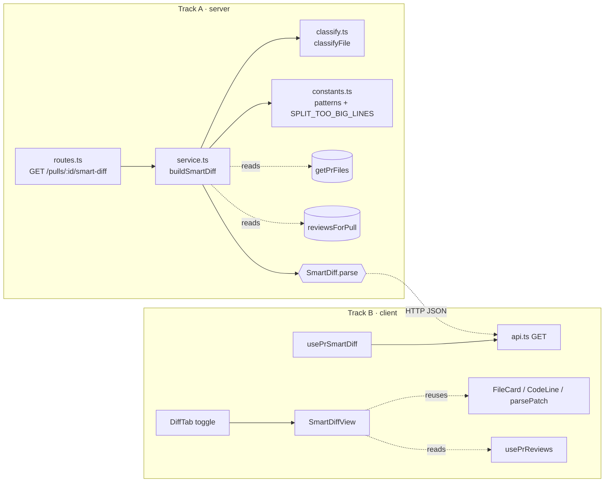

# Development Plan: Smart Diff

**Status:** Draft · **Date:** 2026-06-24 · **Modules:** server, client, shared (read-only)

## 1. Problem statement

The PR "Files changed" tab today renders a flat, alphabetical unified diff. Reviewers must
manually hunt for the files that matter (core logic) amid lockfiles, snapshots, and config noise,
and there is no visual link between a file and the findings the latest review raised against it.

**Smart Diff** reorders the Files-changed view by risk:

- Files are grouped **core → wiring → boilerplate**; the boilerplate group is collapsed by default.
- Files the latest review flagged carry a severity-colored "N findings" badge that, when clicked,
  expands the file and scrolls to the first flagged line. Flagged lines carry per-line severity
  markers.
- A split-suggestion banner appears when the core change is too large, proposing splits grouped by
  top-level directory.

**Key principle:** Smart Diff makes **NO new LLM call**. It deterministically composes two
already-computed sources:

- PR files — `getPrFiles(db, prId)` → `{ path, additions, deletions, patch }` (available right
  after import).
- Latest review findings — `reviewsForPull(db, prId)[0].findings` → `{ file, startLine, severity,
  rationale, ... }` (newest-first; may be absent before the first Run Review).

Desired outcome: a reviewer opens the Files-changed tab and immediately sees the risky files first,
each annotated with its review findings, without waiting on any model call.

## 2. Scope

**In scope:**
- New server module `server/src/modules/smart-diff/` exposing `GET /pulls/:id/smart-diff`, returning
  the existing `SmartDiff` contract. Compute-on-read; no caching.
- Deterministic file classification (`core` / `wiring` / `boilerplate`), grouping in fixed order,
  `finding_lines` and `pseudocode_summary` derivation from the latest review, and the full
  `split_suggestion` heuristic.
- Client `usePrSmartDiff(prId)` hook + a Smart/Original segmented toggle inside the existing
  `DiffTab`, plus a new `SmartDiffView` component that renders the three groups, finding badges,
  per-line severity markers, and the split banner.
- Tests: server hermetic classification table + a DB-backed integration test; client RTL tests.

**Out of scope:**
- Any LLM call, prompt, or new model usage. `pseudocode_summary` is derived purely from existing
  finding rationale text.
- Any DB schema change, migration, or cache table. Smart Diff is computed on read every time.
- Editing the `SmartDiff` Zod contract — it already exists and matches the spec exactly
  (`server/src/vendor/shared/contracts/brief.ts:80-113`; identical client copy). **No contract
  work.**
- Editing translation files (`client/messages/<locale>/*.json`) or any `*/src/vendor/*`.
- A new top-level PR tab. Smart Diff lives **inside** the existing Files-changed (`diff`) tab as a
  toggle.
- Changing the existing flat `DiffViewer` behavior (it remains the "Original order" rendering).
- SSE / streaming. The endpoint is a plain `GET`.

## 3. Affected modules & architectural impact

**server/ (`@devdigest/api`) — Track A**
New feature module mirroring the `brief` module's structure (routes + service), **minus** the
LLM/cache/repository layer. It reads two existing repositories (`pull.repo` `getPrFiles`,
`review.repo` `reviewsForPull`), classifies and composes deterministically, validates with
`SmartDiff.parse()`, and returns. Registered in `server/src/modules/index.ts`. No DB writes, no
migration, no rate-limit config (cheap, no model call).

**client/ (`@devdigest/web`) — Track B**
A new data hook (`usePrSmartDiff`) appended to the existing `client/src/lib/hooks/brief.ts`, a
Smart/Original toggle added to `DiffTab`, and a new `SmartDiffView` feature component that reuses
the diff-rendering primitives (`FileCard`, `CodeLine`, `parsePatch`) and severity tokens
(`SEV_COLOR`). It also reads `usePrReviews` for severity coloring. Page wiring stays in the existing
`diff` tab branch of `page.tsx`.

**reviewer-core/ — none.** No engine logic changes.

**e2e/ — none in this plan.**

**shared (`@devdigest/shared`, vendored) — read-only.** The `SmartDiff`, `SmartDiffGroup`,
`SmartDiffFile`, `SmartDiffRole`, `ProposedSplit` schemas already exist and are exported. Do not
edit either vendor copy.



## 4. Relevant INSIGHTS (distilled)

Cross-cutting (apply to both tracks):
- Parallel implementers share **one working tree** (no worktree isolation). Each task is scoped to
  a strictly non-overlapping file set, and implementers MUST NOT run `git stash` / `git stash drop`
  (it sweeps up and can irreversibly destroy a sibling agent's uncommitted work). Expect transient
  `typecheck`/`test` noise if one agent reads a shared file mid-edit by another — re-run once the
  wave settles before trusting a failure. — `INSIGHTS.md`
- `@devdigest/shared` is **vendored into both** `client/src/vendor/shared` and
  `server/src/vendor/shared` with no in-repo source. For Smart Diff this only matters as a
  guardrail: the `SmartDiff` contract is already present in both copies — do **not** edit either.
  — `INSIGHTS.md`

Server-specific (Track A):
- The `brief` module is the structural template, but note the deliberate differences for Smart Diff:
  `pr_brief` uses a single-blob cache with `head_sha` invalidation; **Smart Diff has no cache, no
  `head_sha` compare, no repository layer** — it is plain compute-on-read. Never add a cache table or
  loosen the shared schema to allow partials. — `server/INSIGHTS.md`
- Routes use **schema-first validation** via `fastify-type-provider-zod` (`IdParams` on `params`);
  invalid id → `422` before the handler. Do not hand-roll `Schema.parse(req.body)`. — `server/CLAUDE.md`
- DB-backed tests **must** use the `*.it.test.ts` suffix (testcontainers Postgres) and gate on
  `dockerAvailable()`; pure logic tests stay hermetic `*.test.ts`. — `server/CLAUDE.md`
- Smart Diff intentionally has **no migration**, so the `_journal.json` migration hazard does not
  apply — flag if anyone proposes a schema change. — `server/INSIGHTS.md`

Client-specific (Track B):
- Data flows **hooks → `api.ts`** only; components never fetch directly. Feature gating uses
  `useFeatureToggle`, not `localStorage`. — `client/CLAUDE.md`
- Tests mock `fetch`; no API or browser is needed. — `client/CLAUDE.md`
- When hand-building `ReviewRecord`/`FindingRecord` fixtures for tests, populate every
  required-but-nullable key (e.g. `cost_usd`) or `tsc` fails. — `client/INSIGHTS.md`
- **`FileCard` and `CodeLine` are NOT re-exported from the diff-viewer barrel**
  (`client/src/components/diff-viewer/index.ts` exports only `DiffViewer` + `DiffCommentApi`).
  Import them by deep path (`@/components/diff-viewer/FileCard/FileCard`,
  `@/components/diff-viewer/CodeLine/CodeLine`); `parsePatch` is in `.../diff-viewer/helpers.ts`. Do
  not edit the barrel — it's shared surface outside Track B's file set. — verified during planning

## 5. Phased task breakdown

> **Parallelism:** Track A (server) and Track B (client) touch **disjoint file sets** and run in
> parallel. Within each track, tasks are sequential where they share files (noted per task). The
> shared `SmartDiff` contract already exists, so there is no contract task blocking either track.

---

### Track A — Server: `GET /pulls/:id/smart-diff`

#### Task A1 — Classification constants & pure `classifyFile` + unit tests · [parallel-track: A]
- **Module(s):** server/
- **Files:**
  - `server/src/modules/smart-diff/constants.ts` — **new**:
    - `BOILERPLATE` patterns: `*-lock.json`, `*.lock`, `pnpm-lock.yaml`, `package.json`, paths under
      `dist/` and `build/`, `*.snap`, paths under `__snapshots__/`, `*.min.js`, `*.map`.
    - `WIRING` patterns: `*.config.*`, `tsconfig*.json`, `.eslintrc*`, CI YAML
      (`.github/workflows/*.yml`/`.yaml`), `Dockerfile`, `*.env*`, index barrels (`index.ts`/
      `index.js`), `server.ts`, `config.ts`.
    - `SPLIT_TOO_BIG_LINES = 400` (exported, tunable; the core-lines threshold).
  - `server/src/modules/smart-diff/classify.ts` — **new**: pure `classifyFile(path: string):
    SmartDiffRole` importing `SmartDiffRole` from `@devdigest/shared`. Precedence **boilerplate →
    wiring → core**.
  - `server/src/modules/smart-diff/classify.test.ts` — **new**: hermetic table-driven test.
- **Skills:** `typescript-expert`, `zod`, `security` (path matching must not be a ReDoS vector —
  prefer literal `endsWith`/segment checks or anchored, non-backtracking globs), `fastify-best-practices`.
- **INSIGHTS:** Import `SmartDiffRole` from vendored shared; do not redeclare. Pure-logic test stays
  hermetic `*.test.ts`.
- **Done when:** `classifyFile` is pure with no I/O; `constants.ts` exports patterns +
  `SPLIT_TOO_BIG_LINES`; `cd server && pnpm exec vitest run src/modules/smart-diff/classify.test.ts`
  passes; `cd server && pnpm typecheck` clean.

#### Task A2 — Service `buildSmartDiff` · [sequential-after: Task A1]
- **Module(s):** server/
- **Files:** `server/src/modules/smart-diff/service.ts` — **new**:
  `buildSmartDiff(container, workspaceId, prId): Promise<SmartDiff>`:
  1. Resolve pull via `container.reviewRepo.getPull(workspaceId, prId)`; throw `NotFoundError` if
     absent (mirror `brief/service.ts`).
  2. Load files via `getPrFiles(container.db, prId)`.
  3. Load latest review findings via `reviewsForPull(container.db, prId)`; `[0]` is newest. Empty
     when no review yet → all `finding_lines` empty, all `pseudocode_summary` null.
  4. Per file: `classifyFile(path)`; `finding_lines` = `startLine` of every latest-review finding
     whose `file` equals the path; `pseudocode_summary` = short deterministic summary derived from
     that file's finding `rationale`(s) when present, else `null`. No LLM.
  5. Build exactly three groups in fixed order `core`, `wiring`, `boilerplate` (always present).
  6. `split_suggestion`: `total_lines` = Σ(additions+deletions) over **core** files; `too_big` =
     `total_lines > SPLIT_TOO_BIG_LINES`; `proposed_splits` = core files grouped by top-level
     directory, each `{ name: <dir>, files: [...] }`. Root files → a stable bucket name.
  7. `return SmartDiff.parse({ groups, split_suggestion })`.
- **Skills:** `fastify-best-practices`, `drizzle-orm-patterns` (read via existing repo functions),
  `zod` (`SmartDiff.parse` gate, no schema loosening), `typescript-expert`, `security` (treat
  finding `rationale`/paths as untrusted text).
- **INSIGHTS:** No cache, no `head_sha`, no repository layer. Reuse `getPrFiles`/`reviewsForPull`.
- **Done when:** returns a `SmartDiff.parse`-valid object; throws `NotFoundError` for missing/foreign
  pull; `cd server && pnpm typecheck` clean. (Behavior verified by A4.)

#### Task A3 — Route + module registration · [sequential-after: Task A2]
- **Module(s):** server/
- **Files:**
  - `server/src/modules/smart-diff/routes.ts` — **new**: default Fastify plugin mirroring
    `brief/routes.ts` **without** `config.rateLimit`. `GET /pulls/:id/smart-diff`,
    `schema: { params: IdParams }`, `getContext` for `workspaceId`, returns `buildSmartDiff(...)`.
  - `server/src/modules/index.ts` — **edit**: import + register `smartDiff`.
- **Skills:** `fastify-best-practices`, `zod`, `typescript-expert`, `security` (no rate-limit OK — no
  LLM cost; route workspace-scoped via `getContext` — a foreign-workspace PR 404s).
- **INSIGHTS:** Module registry is the single wiring point. Schema-first `IdParams` → `422` on a
  non-uuid id. A3 is the **only** Track-A task editing `index.ts`.
- **Done when:** route registered and reachable; `cd server && pnpm typecheck` clean.

#### Task A4 — Integration test (`smart-diff.it.test.ts`) · [sequential-after: Task A3]
- **Module(s):** server/
- **Files:** `server/src/modules/smart-diff/smart-diff.it.test.ts` — **new**: testcontainers test
  following `brief/brief.it.test.ts`. Cover: (1) mixed files, no review → grouping order + roles, all
  `finding_lines` empty / summaries null; (2) with review → flagged files carry `startLine`s + non-null
  summary, unflagged do not; (3) split heuristic both ways; (4) random uuid → 404.
- **Skills:** `fastify-best-practices` (`inject`), `drizzle-orm-patterns` (seeding), `zod`,
  `typescript-expert`, `security`.
- **INSIGHTS:** `*.it.test.ts` + `dockerAvailable()` guard. Fixtures use real columns
  (`pr_files.path/additions/deletions/patch`; `findings.file/start_line/severity/rationale`).
- **Done when:** `cd server && pnpm exec vitest run .it.test` passes (or skips cleanly without
  Docker); `cd server && pnpm typecheck` clean.

---

### Track B — Client: Smart/Original toggle inside the Files-changed tab

#### Task B1 — `usePrSmartDiff` hook · [parallel-track: B]
- **Module(s):** client/
- **Files:** `client/src/lib/hooks/brief.ts` — **edit**: append `usePrSmartDiff(prId)` next to
  `usePrBrief`: `useQuery({ queryKey: ["smart-diff", prId], queryFn: () =>
  api.get<SmartDiff>(\`/pulls/${prId}/smart-diff\`), enabled: !!prId })`. Import `SmartDiff` from
  `@devdigest/shared`.
- **Skills:** `react-best-practices`, `next-best-practices`, `zod`, `typescript-expert`, `security`.
- **INSIGHTS:** Data flows hooks → `api.ts` only. B1 is the **only** Track-B task editing `brief.ts`.
- **Done when:** `usePrSmartDiff` exported and typed against `SmartDiff`; `cd client && pnpm typecheck`
  clean.

#### Task B2 — `SmartDiffView` component + styles + tests · [parallel-track: B]
- **Module(s):** client/
- **Files (all new, under `client/src/app/repos/[repoId]/pulls/[number]/_components/SmartDiffView/`):**
  - `SmartDiffView.tsx` — presentational view receiving the `SmartDiff` data, the PR `files` (for
    `patch` lookup by path), and the latest-review findings (for severity). Three role groups in
    fixed order with header + short description; **boilerplate collapsed by default**. Reuse
    `FileCard` (`@/components/diff-viewer/FileCard/FileCard`) and `parsePatch`
    (`@/components/diff-viewer/helpers`), matching a `SmartDiffFile.path` to its `PrFile`. Files with
    findings show an "N findings" badge colored by the **highest** severity (`SEV_COLOR` from
    `FindingCard/constants`); click → expand + scroll to first `finding_lines` line. Flagged lines
    render per-line severity markers. Split banner when `split_suggestion.too_big`.
  - `styles.ts` — colocated styles (follow the diff-viewer `styles.ts` pattern).
  - `SmartDiffView.test.tsx` — RTL (mock `fetch`): group order; boilerplate collapse→expand; flagged
    file badge + click reveals/scrolls; split banner only when `too_big`.
- **Skills:** `react-best-practices`, `react-testing-library`, `next-best-practices`, `zod`,
  `typescript-expert`, `security` (render text via JSX auto-escaping; no `dangerouslySetInnerHTML`;
  line-jump uses in-page scroll, not a URL from untrusted input).
- **INSIGHTS:** Tests mock `fetch`. Import `FileCard`/`CodeLine` by **deep path** (not the barrel);
  do not edit the diff-viewer barrel. Reuse `SEV_COLOR`/`SEV_COLOR_FALLBACK`. Populate every required
  fixture key.
- **Done when:** renders all three groups + collapse/expand + badges + per-line markers + split
  banner; `cd client && pnpm exec vitest run src/app/repos/[repoId]/pulls/[number]/_components/SmartDiffView`
  passes; `cd client && pnpm typecheck` clean.

#### Task B3 — `DiffTab` toggle + page wiring · [sequential-after: Task B2]
- **Module(s):** client/
- **Files:**
  - `client/src/app/repos/[repoId]/pulls/[number]/_components/DiffTab/DiffTab.tsx` — **edit**: add a
    "Smart order / Original order" segmented toggle (default **Smart**), gated by `useFeatureToggle`.
    **Original** = current flat `DiffViewer` (unchanged, comments preserved). **Smart** =
    `SmartDiffView` fed by `usePrSmartDiff(prId)` + `usePrReviews(prId)`. Skeleton while loading;
    graceful fallback to Original if the smart-diff query errors/empties.
  - `client/src/app/repos/[repoId]/pulls/[number]/page.tsx` — **edit**: no new top-level tab; existing
    `tab === "diff"` branch already renders `DiffTab`. Thread any new prop/toggle key minimally; may
    be a no-op.
- **Skills:** `react-best-practices` (accessible segmented control, derive don't store, no falsy-`0`
  pitfalls), `next-best-practices`, `react-testing-library`, `zod`, `typescript-expert`, `security`.
- **INSIGHTS:** Feature gating via `useFeatureToggle`, never `localStorage`. B3 is the only task
  editing `DiffTab.tsx`/`page.tsx`; runs after B2.
- **Done when:** toggle switches flat (Original) ↔ `SmartDiffView` (Smart), defaulting to Smart,
  gated by `useFeatureToggle`; `cd client && pnpm test` passes; `cd client && pnpm typecheck` clean.

## 6. Testing strategy

- **A1** — hermetic `classify.test.ts`: role assignment + precedence. No DB.
- **A2** — covered behaviorally by A4; typecheck self-verifies signature + parse shape.
- **A3** — typecheck + A4 (404 + 200 through the real plugin) confirm registration/routing.
- **A4** — `smart-diff.it.test.ts` (testcontainers, `dockerAvailable()` gate).
- **B1** — exercised through B2/B3 (thin hook; test through the component).
- **B2** — `SmartDiffView.test.tsx` (RTL, mocked `fetch`).
- **B3** — `DiffTab` toggle tests.
- Gates: `cd server && pnpm test`, `cd client && pnpm test`.

## 7. Risks & mitigations

- **Empty groups vs schema:** emit all three groups always and validate with `SmartDiff.parse`; A4
  asserts the empty case. Never "fix" by editing the vendored schema.
- **`pseudocode_summary` quality:** keep it a short deterministic summary (first sentence / truncated
  join) from finding `rationale`; document the rule. No LLM.
- **Root-file bucketing:** define a stable bucket name in A2; assert in A4.
- **Barrel reuse:** import `FileCard`/`CodeLine` by deep path; do not modify the shared barrel.
- **Parallel-tree hazard:** forbid `git stash` in both implementers; rely on the strict file
  partition (server vs client; `index.ts` only in A3; `brief.ts` only in B1;
  `DiffTab.tsx`/`page.tsx` only in B3).
- **Transient cross-file test flakiness** while waves run: re-run module `test`/`typecheck` after the
  wave settles before trusting a failure.

## 8. End-to-end verification

```bash
# Track A
cd server && pnpm typecheck
cd server && pnpm exec vitest run src/modules/smart-diff/classify.test.ts
cd server && pnpm exec vitest run .it.test     # smart-diff.it.test.ts (skips cleanly without Docker)

# Track B
cd client && pnpm typecheck
cd client && pnpm test                          # includes SmartDiffView + DiffTab tests
```

Manual smoke (optional, both tracks landed):

```bash
./scripts/dev.sh            # Postgres + API (:3001) + web (:3000), seeded
# With the feature toggle on, open a PR's Files-changed tab:
#   - Smart order default; groups core → wiring → boilerplate, boilerplate collapsed.
#   - After Run Review, flagged files show a severity-colored "N findings" badge that expands +
#     scrolls to the first flagged line; flagged lines carry per-line severity markers.
#   - A large core change shows the split-suggestion banner.
#   - Toggling to Original order restores the existing flat diff.
curl -s localhost:3001/pulls/<pr-uuid>/smart-diff | jq '.groups[].role, .split_suggestion.too_big'
```
